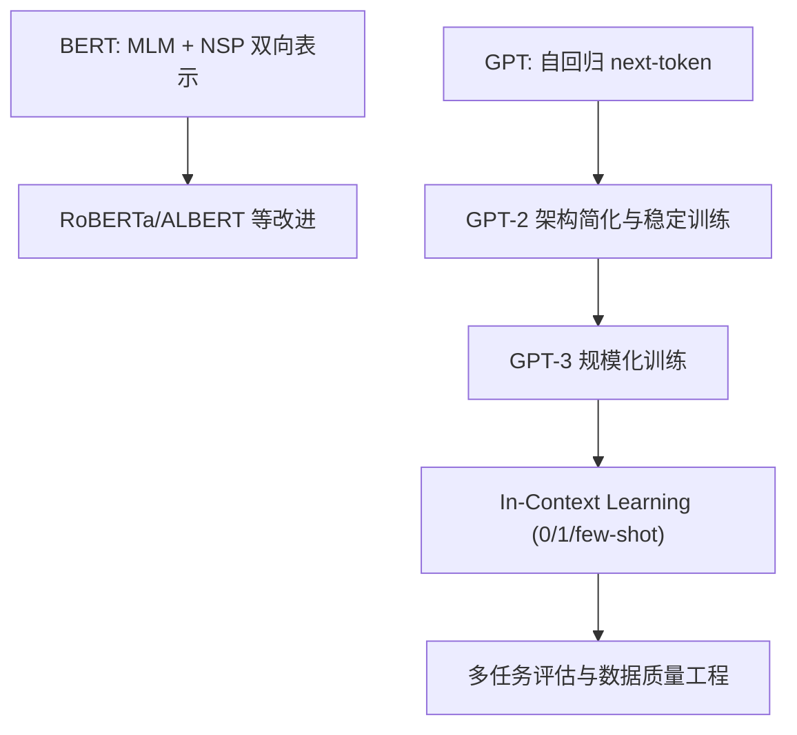

# LLM（Chapter 5）

> 主题：现代 GPT、预训练范式与 Scaling Laws（Modern GPTs, Pre-training, and Scaling Laws）

## 一句话理解

这一讲把 LLM 从“结构机制”推进到“训练范式”：对比 BERT 与 GPT 路线，解释预训练-微调范式的优劣，并说明 GPT-3 如何通过规模化训练与 in-context learning 改变任务适配方式。

---

## 本讲核心问题

- BERT 与 GPT 的预训练目标有什么根本差异？
- 为什么 GPT-2/3 选择纯自回归路线并持续扩容？
- Scaling Law 对训练超参（batch、learning rate、tokens）有什么启发？
- in-context learning 为什么能在无梯度更新下完成任务迁移？

---

## 1. 训练全流程：Pre-training -> Fine-tuning -> Inference

课件先给出统一框架：

1. 预训练（Pre-training）：大规模通用语料学习通用语言能力
2. 微调（Fine-tuning）：小规模任务数据做能力对齐
3. 推理（Inference）：基于已学能力做生成或判别

“预训练一次、下游多用”是现代大模型工程主线。

---

## 2. BERT 路线：双向表示学习

### 2.1 核心思想

- 基于 Transformer Encoder；
- 使用双向上下文建模词义；
- 典型预训练任务：MLM（Masked Language Modeling）+ NSP（Next Sentence Prediction）。

### 2.2 MLM 的关键策略

- 常见 masking 比例：15%；
- 80-10-10 规则：
  - 80% 替换为 `[MASK]`
  - 10% 替换为随机词
  - 10% 保持原词

这能在“预测难度”与“训练-推理分布差异”间做折中。

### 2.3 局限与后续改进

课件提到后续工作对 NSP 有争议，RoBERTa 等模型通过去 NSP、增数据、延长训练获得更强表现。

---

## 3. GPT 路线：纯自回归生成

### 3.1 目标函数

GPT 采用 next-token prediction：

  $$
  \max_{\theta}\sum_{t=1}^{T}\log p_{\theta}(x_t\mid x_{<t}).
  $$

与 BERT 的 MLM 不同，它天然匹配文本生成任务。

### 3.2 GPT-2 的关键更新

- 去掉 encoder/cross-attention，采用 decoder-only；
- 继续扩大上下文窗口；
- 采用 Pre-LN（LayerNorm 位置调整）提高深层训练稳定性；
- 规模化参数扩展。

---

## 4. GPT-3：规模化 + In-Context Learning

### 4.1 规模化训练特征

- 参数规模提升到 175B；
- 训练 token 数量极大（课件给出 300B）；
- 上下文窗口扩展（如 2048）；
- 采用模型并行等系统优化。

### 4.2 Scaling Laws 直觉

课件强调验证损失随规模变化近似幂律（power-law）趋势。  
实务启发：

- 更大模型通常配更大 batch；
- 学习率往往需更谨慎（通常更小）。

---

## 5. In-Context Learning（ICL）：无参数更新的任务适配

GPT-3 的核心范式变化：

- Zero-shot：只给任务说明；
- One-shot：给 1 个示例；
- Few-shot：给 K 个示例（常见 10-100，受上下文窗口限制）。

目标是在不 fine-tune 的前提下，通过上下文示例完成任务迁移。

一句话：把“学习过程”从参数空间部分转移到 prompt/context 空间。

---

## 6. 数据质量工程：规模不等于质量

课件指出训练数据不仅要“大”，还要“净”：

- Common Crawl 等大规模来源需要重过滤；
- 文档去重（deduplication）显著降低重复噪声；
- 与高质量语料混合提高数据分布质量与多样性。

这解释了为何“同等参数规模”模型性能也会明显不同。

---

## 7. 评估视角：多任务与指标

课件展示了 Cloze、Closed-book QA、Translation 等评估任务。  
以 BLEU 为例，其核心是 n-gram 重叠 + 短句惩罚（brevity penalty）：

  $$
  \text{BLEU}
  =
  \text{BP}\cdot
  \exp\!\left(\sum_{n} w_n\log p_n\right),
  $$

其中 $p_n$ 是 n-gram precision。

---

## 8. 这一讲的关键结论

- BERT 更偏表示学习，GPT 更偏生成建模；
- 纯自回归目标与生成任务更一致；
- 规模化 + 数据治理 + ICL 三者共同塑造了现代 GPT 能力；
- “预训练+微调”并非唯一道路，prompt-based 迁移已成主流能力之一。

---

## 知识流程图

---

## 常见误区

### 误区 1：参数越大就一定更好

不对。数据质量、训练策略和推理方式同样决定上限。

### 误区 2：BERT 与 GPT 只是“模型大小不同”

不对。两者预训练目标和任务适配机制都不同。

### 误区 3：Few-shot 永远优于 Zero-shot

不对。示例质量和任务匹配度不佳时，few-shot 也可能退化。

---

## 本讲小结

- 第 5 讲建立了现代 LLM 训练范式的核心图景：目标函数、规模律、数据治理与 ICL。
- 这为后续 RLHF / DPO、RAG 与 Agent 课程打下了“能力来源”层面的理论基础。
