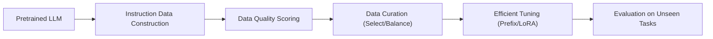

# LLM（Chapter 6）

> 主题：指令微调（Instruction Tuning）、高效微调（Efficient Fine-tuning）与数据质量（Data Quality）

## 一句话理解

这节课把关注点从“怎么把模型训练大”转到“怎么把模型对齐好、调得省、数据选得准”：LLM 能否成为好助手，关键不只在参数规模，还在指令数据和微调策略。

---

## 本讲核心问题

- 为什么预训练语言模型（Pretrained Language Model）不等于可用助手（Assistant）？
- 指令微调（Instruction Tuning）到底在优化什么？
- 数据量（Quantity）和数据质（Quality）哪个更决定下游能力？
- 全参数微调成本太高时，Prefix/LoRA 这类方法为什么有效？

---

## 1. 为什么需要指令微调（Instruction Tuning）

预训练目标通常是“预测下一个词”，但用户真实需求是“遵循任务指令并给出有用答案”。  
所以我们需要把目标从语言建模转为“指令-响应”对齐。

传统语言建模目标：

  $$
  \max_{\theta}\sum_{t=1}^{T}\log p_{\theta}(x_t\mid x_{<t}).
  $$

指令微调目标（以监督微调 SFT 为例）：

  $$
  \max_{\theta}\sum_{(x,y)\in\mathcal{D}_{\mathrm{inst}}}\log p_{\theta}(y\mid x).
  $$

一句话理解：从“续写文本”变成“按要求完成任务”。

---

## 2. 指令微调的三种范式（Paradigms）

| 范式                    | 训练方式                         | 泛化特点           |
| ----------------------- | -------------------------------- | ------------------ |
| 任务内微调              | 在任务 A 上训练并在 A 上测试     | 擅长同分布任务     |
| 纯提示学习（Prompting） | 不更新参数，用 zero/one/few-shot | 快速但不稳定       |
| 多任务指令微调          | 在大量任务指令上统一微调         | 对未见任务泛化更好 |

课程重点指出：FLAN 系列证明了“多任务 + 多模板指令”能显著提升 unseen tasks 表现，尤其对 NLI、QA、翻译等“天然可指令化”任务更有效。

---

## 3. Chain-of-Thought（CoT）在指令微调中的作用

课程强调了一个实用结论：  
混合训练（CoT + 非 CoT）通常比“只用 CoT”更稳，且不会明显损害非 CoT 任务表现。

直觉上，CoT 提供“中间推理轨迹”，非 CoT 保留“直接答题能力”。二者结合，能避免模型过拟合到单一输出风格。

---

## 4. 指令数据从哪里来：构建方式与核心矛盾

常见数据构建路径：

1. 人工编写（Human-written）
2. 人工问题 + 强模型回答（Distillation）
3. 模型自生成（Self-Instruct / UltraChat）

核心矛盾：  
要提升性能，通常需要更广覆盖和更大数据；但高质量人工数据昂贵且慢。

这引出课程后半部分主线：数据筛选（Data Selection）与评分策展（Score Curation）。

---

## 5. 数据质量（Quality）比数据数量（Quantity）更关键

课件总结了近年的共同观察：指令阶段常常不是“越多越好”，而是“更干净、更代表任务空间的数据”更有效。

可写成“有效数据量”视角：

  $$
  N_{\mathrm{eff}}
  =
  \sum_{i=1}^{N} w_i,\quad 0\le w_i\le 1,
  $$

其中 \(w*i\) 表示样本质量权重。  
如果低质量样本很多，名义样本数 \(N\) 很大，但 \(N*{\mathrm{eff}}\) 可能并不高。

一句话理解：不是“喂更多”，而是“喂更对”。

---

## 6. LLM 评分选数（Rating-based Selection）的机会与误差

课程展示了用 LLM 给样本打分并筛选训练数据的路线，同时指出评分存在系统误差：

- 评分模型越弱，噪声通常越大
- 单一评分器容易把“风格偏好”当成“质量标准”
- 需要结合一致性（Consensus）与多样性（Diversity）做校正

实证结论很关键：经过评分策展的小规模子集，可能超过全量原始数据训练效果。

---

## 7. 高效微调（Efficient Fine-tuning）

### 7.1 Prefix Tuning

冻结原模型参数，只学习可训练前缀向量（prefix tokens）来调控注意力上下文。  
好处是每个任务只需存很小的参数增量。

抽象表达：

  $$
  h^{(\ell)}=\mathrm{Transformer}^{(\ell)}\!\big([P^{(\ell)};h^{(\ell-1)}]\big),
  $$

其中 \(P^{(\ell)}\) 是第 \(\ell\) 层可学习前缀。

### 7.2 LoRA（Low-Rank Adaptation）

将权重更新限制为低秩分解：

  $$
  W' = W_0 + \Delta W,\qquad \Delta W = BA,\qquad \mathrm{rank}(\Delta W)=r\ll d.
  $$

这意味着我们不直接更新完整矩阵，而只学习小秩增量，显著降低显存与存储成本。

---

## 方法流程图

---

## 常见误区

### 误区 1：只要基座模型足够大，就不需要指令微调

不对。大模型有语言能力，不代表自动具备“遵循用户意图”的对齐能力。

### 误区 2：指令数据越多越好

不对。低质量或分布偏的数据会拉低有效训练信号。

### 误区 3：高效微调一定不如全参数微调

不对。在很多资源受限场景，Prefix/LoRA 可以达到非常接近的效果，且部署更灵活。

---

## 本讲小结

- 指令微调解决的是“能力到可用性”的最后一公里问题。
- 数据工程重点正从“规模驱动”转向“质量驱动 + 选择驱动”。
- 高效微调方法（Prefix/LoRA）是多任务、低成本持续迭代的关键工具。
