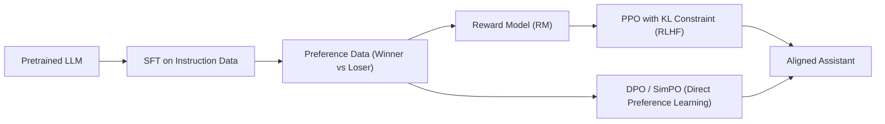

# LLM（Chapter 7）

> 主题：基于人类反馈的强化学习（Reinforcement Learning from Human Feedback, RLHF）与偏好优化（Preference Optimization）

## 一句话理解

这节课回答的是“模型会说话，为什么还不会当助手”：监督微调（SFT）只告诉模型“什么是好答案”，RLHF 进一步告诉它“哪些答案不好、为什么不好”，从而把能力对齐到 Helpful、Honest、Harmless。

---

## 本讲核心问题

- 为什么仅靠监督微调（Supervised Fine-Tuning, SFT）仍然会出现有害或不可信输出？
- 奖励模型（Reward Model, RM）如何把人类偏好变成可优化信号？
- PPO 在 RLHF 中具体优化什么，为什么要加 KL 约束？
- DPO（Direct Preference Optimization）为何能绕开显式 RL？

---

## 1. 为什么需要 RLHF

预训练 + SFT 的典型问题是：模型主要见到“正样本答案”，缺少“负反馈”。  
结果是它可能语法很好，但在安全、真实、服从意图上仍然失配（misalignment）。

课程里的目标框架是：

- Helpful：能解决用户任务
- Honest：信息尽量真实，减少幻觉（Hallucination）
- Harmless：避免伤害性输出

一句话理解：RLHF 不是让模型“更会写”，而是让模型“更会负责”。

---

## 2. RLHF 三步法（InstructGPT 经典流程）

### Step 1：监督微调（SFT）

用指令-答案数据训练初始策略 \(\pi\_{\text{sft}}\)：

  $$
  \max_{\theta}\ \mathbb{E}_{(x,y)\sim \mathcal{D}_{\text{sft}}}\big[\log \pi_{\theta}(y\mid x)\big].
  $$

### Step 2：奖励建模（Reward Modeling）

收集偏好对 \((y*w, y_l)\)（winner/loser），学习打分函数 \(r*\phi(x,y)\in\mathbb{R}\)。

常见 Bradley-Terry 偏好损失：

  $$
  \mathcal{L}_{\text{RM}}(\phi)
  =
  -\mathbb{E}\left[
  \log \sigma\big(r_\phi(x,y_w)-r_\phi(x,y_l)\big)
  \right].
  $$

### Step 3：基于奖励的策略优化（PPO）

让策略在 RM 上得分更高，同时不要偏离 \(\pi\_{\text{sft}}\) 太远。

---

## 3. PPO 目标与 KL 约束直觉

在 LLM 场景中，若只最大化 RM 分数，模型会“钻奖励函数空子”（reward hacking）。  
所以课程强调要加入 KL 正则，约束新策略不要远离参考策略。

常见形式：

  $$
  \max_{\pi_{\theta}}\ 
  \mathbb{E}_{x,y\sim \pi_\theta}\!\left[
  r_\phi(x,y)
  -\beta\,D_{\mathrm{KL}}\!\big(\pi_\theta(\cdot\mid x)\,\|\,\pi_{\text{ref}}(\cdot\mid x)\big)
  \right].
  $$

其中 \(\pi\_{\text{ref}}\) 通常来自 SFT 模型。  
\(\beta\) 越大，策略更新越保守。

课程还提到 PPO-ptx：在 RL 期间混入部分预训练损失，缓解对通用 NLP 能力的回退（alignment tax）。

---

## 4. 评测观察：对齐收益与代价并存

课件中 InstructGPT 相关结果呈现出典型现象：

- 人类偏好维度显著优于纯 GPT-3 基线
- Truthfulness / Toxicity 部分场景改善明显
- 某些公共基准能力会出现回退（alignment tax）

一句话理解：对齐不是免费午餐，关键是“对齐收益”和“通用能力损失”的平衡。

---

## 5. DPO：不显式训练 RM/PPO 的偏好优化

Direct Preference Optimization（DPO）把“偏好学习”直接写成策略的分类目标。  
它用偏好对数据直接优化策略，不再显式跑 RL rollout。

常见 DPO 损失可写为：

  $$
  \mathcal{L}_{\text{DPO}}(\theta)
  =
  -\mathbb{E}\left[
  \log \sigma\!\Big(
  \beta\big(
  \log \pi_\theta(y_w\mid x)-\log \pi_\theta(y_l\mid x)
  -
  \log \pi_{\text{ref}}(y_w\mid x)+\log \pi_{\text{ref}}(y_l\mid x)
  \big)
  \Big)
  \right].
  $$

优势是训练流程更简单、稳定性通常更好；代价是对偏好数据质量依赖更强。

---

## 6. SimPO 与 RLAIF

### SimPO（Simple Preference Optimization）

课件强调其核心思想：进一步简化偏好优化目标，减少对参考模型的依赖，使训练更轻量。

### RLAIF（RL from AI Feedback）

把“人类反馈”部分替换为“AI 反馈”：

- 成本更低、可扩展性更强
- 在某些 helpful/harmless 任务上可接近甚至超过 RLHF
- 关键风险在于评审模型偏差会被放大

---

## 方法关系图

---

## 常见误区

### 误区 1：RLHF 就是“继续训练更久”

不对。它优化目标已经从语言建模转向“偏好对齐”。

### 误区 2：有了 RM 就一定更安全

不对。奖励模型本身可能有偏差，策略可能过拟合 RM。

### 误区 3：DPO 一定全面替代 RLHF

不对。DPO 简化了流程，但在复杂在线反馈和探索场景下，RL 路线仍有价值。

---

## 本讲小结

- RLHF 的核心是把“人类偏好”转成可优化信号，并通过 KL 约束防止策略漂移。
- PPO-ptx 揭示了对齐训练中的关键工程权衡：偏好提升 vs 通用能力回退。
- DPO/SimPO 代表了“去 RL 化”的偏好优化趋势，RLAIF 则代表“反馈来源自动化”的扩展方向。
