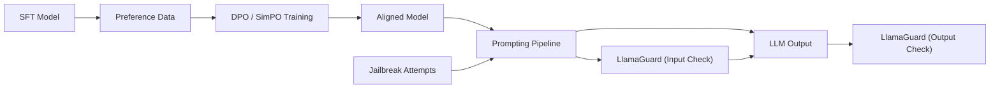

# LLM（Chapter 8）

> 主题：直接偏好优化（Direct Preference Optimization, DPO）、Prompting 方法与 LlamaGuard 安全防护

## 一句话理解

这一讲把“模型对齐”和“实际使用”连起来了：前半部分讲如何用 DPO/SimPO 做偏好学习，后半部分讲如何通过 Prompting 提升效果并用 LlamaGuard 抵御越狱攻击（Jailbreak）。

---

## 本讲核心问题

- DPO 为什么能在不显式 PPO rollout 的情况下优化偏好？
- Prompting 怎样从“经验技巧”变成“可评估工程流程”？
- CoT（Chain-of-Thought）为什么有时有效但不总是可靠？
- 面对 Jailbreak，系统层应该如何做输入输出双重防护？

---

## 1. 从 RLHF 到 DPO：偏好优化路径演进

课程先回顾 RLHF 的典型问题：流程复杂、训练成本高、对超参敏感。  
DPO 的思路是把偏好数据直接转成监督式目标，减少显式强化学习环节。

给定偏好对 \((y_w, y_l)\)（winner / loser），常见 DPO 损失为：

  $$
  \mathcal{L}_{\mathrm{DPO}}(\theta)=
  -\mathbb{E}\left[
  \log \sigma\!\Big(
  \beta \big(
  \log \pi_\theta(y_w\mid x)-\log \pi_\theta(y_l\mid x)
  -
  \log \pi_{\mathrm{ref}}(y_w\mid x)+\log \pi_{\mathrm{ref}}(y_l\mid x)
  \big)
  \Big)
  \right].
  $$

其中 \(\beta\) 控制偏好分离强度，\(\pi\_{\mathrm{ref}}\) 是参考策略（通常来自 SFT）。

一句话理解：DPO 把“更喜欢哪个回答”直接变成分类信号来训练策略。

---

## 2. SimPO 与在线/离线偏好优化

课件提到 SimPO（Simple Preference Optimization）继续简化偏好目标，降低参考模型依赖。  
实践上可把偏好优化分成两类：

| 路线       | 数据来源           | 优势           | 风险               |
| ---------- | ------------------ | -------------- | ------------------ |
| Offline PO | 固定偏好数据集     | 稳定、成本可控 | 覆盖不足、分布陈旧 |
| Online PO  | 训练中持续采样反馈 | 可适应新分布   | 工程复杂、成本更高 |

---

## 3. Prompting 六大策略（工程化视角）

课程给出可落地的六类策略：

1. 写清晰指令（Write Clear Instructions）
2. 提供参考文本（Provide Reference Text）
3. 拆分复杂任务（Split Complex Tasks）
4. 让模型“先思考再回答”（Give Time to Think）
5. 使用外部工具（Use External Tools）
6. 系统化评测（Test Changes Systematically）

核心思想：Prompt 不是“文案技巧”，而是“任务接口设计”。

---

## 4. CoT、Least-to-Most、ToT：从线性推理到搜索

### 4.1 CoT（Chain-of-Thought）

- Few-shot CoT：依赖示例设计
- Zero-shot CoT：工程门槛更低，但通常要两轮提示

### 4.2 Least-to-Most Prompting

先把难题拆成子问题，再按顺序求解，适合“示例难度不足以直接覆盖”的任务。

### 4.3 Tree of Thoughts（ToT）

把中间“思路”当作树节点，进行生成-评估-选择的搜索流程。  
可抽象为：

  $$
  y^*=\arg\max_{y\in\mathcal{Y}_{\mathrm{search}}} V(y),
  $$

其中 \(V(\cdot)\) 是对中间/最终思路的评估函数。

---

## 5. CoT 的一个关键提醒：可读不等于可信

课件展示了“Unfaithful Explanations”现象：  
模型可能给出看似合理的推理链，但真实决策依据并不一致。

这意味着：

- 解释文本可用于可读性，不应直接视为因果证据
- 需要通过扰动试验（截断、插错、改写）验证推理依赖性

一句话理解：会解释，不代表真按解释在思考。

---

## 6. Jailbreak 攻击面与防护思路

课程把攻击分为白盒（white-box）和黑盒（black-box）：

- 白盒：梯度/对数几率/恶意微调等
- 黑盒：场景嵌套、上下文注入、代码注入、加密改写、低资源语言迁移、进化式提示变异

系统防护不应只靠单条拒答规则，而应做分层防御：

1. 输入侧检测
2. 生成侧约束
3. 输出侧审查
4. 事后监控与回放评估

---

## 7. LlamaGuard：输入-输出双向安全网

LlamaGuard 被设计为对话场景的安全分类器，可同时检查：

- 用户输入（Prompt）
- 模型输出（Response）

它输出：

1. `safe` 或 `unsafe`（单 token）
2. 若 `unsafe`，附违规类别（如 Violence & Hate、Self-harm 等）

这类 Guardrail 模型本质上是“策略外判器”，用于把“主模型能力”与“合规决策”解耦。

---

## 方法关系图

---

## 常见误区

### 误区 1：DPO 是 RLHF 的“免费替代”

不对。DPO 简化了流程，但效果仍依赖偏好数据质量和参考策略选择。

### 误区 2：Prompt 调得好就不需要工具和评测

不对。复杂任务通常需要 RAG/工具调用和系统化 eval。

### 误区 3：加一个安全分类器就万无一失

不对。安全需要输入、推理过程、输出和线上监控的联合防御。

---

## 本讲小结

- DPO/SimPO 代表了偏好优化“去 RL 化”的工程趋势。
- Prompting 应该与任务拆解、工具调用、评测体系一起设计。
- 面对 Jailbreak，LlamaGuard 这类 I/O 双向防护是关键基础设施，但必须配合整体安全流程。
