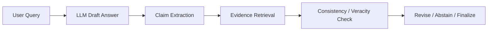

# LLM（Chapter 10）

> 主题：大语言模型幻觉（LLM Hallucination）成因、评估与缓解

## 一句话理解

这节课的核心是把“幻觉”当作系统性问题来处理：它不只来自模型知识缺口，还来自对齐目标、解码策略和推理流程，因此需要训练前、训练中、对齐阶段和推理阶段的联合治理。

---

## 本讲核心问题

- 什么是幻觉（Hallucination），有哪些主要类型？
- 为什么模型会“看起来很自信地错”？
- 幻觉怎么评估，为什么不能只看最终回答流畅度？
- 在预训练、SFT、RLHF、推理阶段分别如何降低幻觉？

---

## 1. 幻觉定义与三类冲突

课程将幻觉概括为“貌似合理但与事实/上下文不一致”的生成，常见三类：

- 输入冲突（Input-conflicting）：偏离用户问题
- 上下文冲突（Context-conflicting）：长回答或多轮自相矛盾
- 事实冲突（Fact-conflicting）：与外部世界知识不一致

一句话理解：幻觉不是“句子不通顺”，而是“语义上不真实”。

---

## 2. 幻觉来源：四个主要机制

### 2.1 知识缺失或错误内化

模型可能把“位置邻近/高共现”误当作事实因果，导致伪知识内化。

### 2.2 能力高估（不知道自己不知道）

面对不可回答问题，模型仍倾向给出确定性答案，而不是拒答或表达不确定性。

### 2.3 对齐副作用（如迎合倾向）

对齐目标设计不当时，模型可能偏向“迎合用户立场（sycophancy）”而非追求真实。

### 2.4 解码风险与误差滚雪球

Top-k / Top-p 等采样会放大早期错误，形成 snowball hallucination。

---

## 3. 幻觉评估：生成与判别两条线

课件强调两类评估任务：

- 生成评估（Generation）：能否生成事实性陈述
- 判别评估（Discrimination）：能否区分事实与非事实陈述

除了准确率，实际系统也要关注：

- 可校验性（是否可追溯证据）
- 一致性（多次生成是否稳定）
- 不确定性校准（置信度与正确率是否匹配）

---

## 4. 分阶段缓解策略

### 4.1 预训练阶段（Pre-training）

目标是降低噪声知识注入：

- 高质量语料筛选与去噪
- 事实性来源上采样（如百科类）
- 低质量网页规则过滤

### 4.2 监督微调阶段（SFT）

目标是减少“行为克隆导致的错误模仿”：

- 小规模高质量 SFT 数据
- 诚实导向样本（Honesty-oriented SFT）
- 自动/人工数据策展

### 4.3 RLHF 阶段

目标是把“诚实性”显式加入奖励：

- 合成幻觉样本训练奖励模型
- 设计偏向事实性的奖励函数
- 过程监督（Process Supervision）约束中间推理步骤

可写成含诚实惩罚项的目标：

  $$
  \max_{\pi_\theta}\ 
  \mathbb{E}\!\left[r_{\text{helpful}}-\lambda\,r_{\text{hallucination}}\right].
  $$

### 4.4 推理阶段（Inference-time）

目标是“边生成边纠偏”：

- 事实性采样（factual-nucleus sampling）
- 外部知识校验（检索增强、post-hoc correction）
- 自检流程（claim extraction -> retrieval -> evidence check -> verdict）
- 不确定性感知（logit / verbalized / consistency）
- 多智能体互审（multi-agent interaction）

---

## 5. 不确定性与幻觉的关系

课程指出：不确定性管理是抑制幻觉的关键入口。  
常见 token 分布不确定性可用熵表示：

  $$
  H_t=-\sum_{v\in\mathcal{V}} p(v\mid x,y_{<t})\log p(v\mid x,y_{<t}).
  $$

当 \(H_t\) 高且证据不足时，系统更应触发“检索/澄清/拒答”策略，而不是继续强行生成。

---

## 6. Self-checker 思路（推理后校验）

课件里的 Self-checker 流程可概括为：

1. 从回答中抽取可验证 claim
2. 为 claim 生成检索 query
3. 匹配证据句
4. 汇总判定支持/冲突/不确定

一句话理解：先生成，再做事实审计。

---

## 7. 方法流程图

---

## 常见误区

### 误区 1：参数更大就不会幻觉

不对。大模型通常更流畅，但仍可能在未知域高自信出错。

### 误区 2：加 RAG 就能完全解决幻觉

不对。检索错配、证据噪声、错误引用都会继续产生事实偏差。

### 误区 3：只在训练阶段处理就够了

不对。推理时的采样、校验与拒答策略同样关键。

---

## 本讲小结

- 幻觉是“知识、对齐、解码、推理链路”共同作用的结果。
- 有效治理依赖分阶段策略，而非单点补丁。
- 未来高可靠 LLM 的关键能力，是“会答”之外的“会校验、会承认不确定、会安全退让”。
