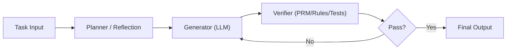

# LLM（Chapter 11）

> 主题：LLM Programs、Verifier 与 DSPy：从单模型到复合系统（Compound AI Systems）

## 一句话理解

这节课强调一个重要转向：高质量 AI 应用不再等于“换更大模型”，而是通过程序化编排多个模块（生成、检验、检索、筛选）构成复合系统，以提升可靠性、可控性和成本效率。

---

## 本讲核心问题

- 什么是复合 AI 系统（Compound AI Systems），为什么它常优于单次生成？
- 为什么需要 Verifier，尤其是过程监督（Process Supervision）？
- PRM（Process Reward Model）如何给多步推理打分？
- DSPy 如何把“提示工程”升级为“可优化的程序工程”？

---

## 1. 从“模型中心”到“系统中心”

课件用 AlphaCode 2、AlphaGeometry、AlphaCodium 说明：

- 单次直接回答通常不稳定
- 通过“多样本生成 + 测试筛选 + 聚类去重 + 评分器重排”可以显著提质
- 结合检索、符号求解器、规则模块后，系统整体能力可超过单模型上限

一句话理解：系统设计把“概率成功”变成“工程可控成功”。

---

## 2. AlphaCodium 流程直觉：先想清楚，再写代码，再迭代

课程展示了典型三段式：

1. 预处理：问题反思、测试推理、候选方案生成与排序
2. 代码生成：产出初始解
3. 迭代修复：在公开测试与 AI 生成测试上循环 run-fix

核心洞察是：  
“生成高质量测试用例”往往比“一步到位生成正确解”更容易，也更稳。

---

## 3. Verifier：为什么要做“过程监督”而不是只看最终答案

结果监督（Outcome Supervision）只看最终对错，容易出现“答案对但推理错”。  
过程监督（Process Supervision）对每一步打标签，更适合发现幻觉和错误链条。

课程要点：

- 过程标签更可解释
- 过程监督训练出的奖励模型更可靠
- 在 Best-of-N 搜索中，PRM 排序通常优于 ORM 和多数投票

---

## 4. PRM（Process Reward Model）打分机制

设一条解题轨迹有 \(K\) 个推理步骤，PRM 给每一步正确概率 \(r_k\in(0,1)\)。  
常见轨迹得分可定义为“全步正确概率乘积”：

  $$
  s_{\mathrm{PRM}}(\tau)=\prod_{k=1}^{K} r_k.
  $$

训练时可对步骤标签做二分类似然最大化：

  $$
  \mathcal{L}_{\mathrm{PRM}}
  =
  -\sum_{k=1}^{K}
  \big[
  y_k\log r_k + (1-y_k)\log(1-r_k)
  \big].
  $$

这让 PRM 能直接用于“搜索时重排”而不必依赖最终答案才给反馈。

---

## 5. Math-Shepherd：自动化构建过程监督数据

课件提到的思路是：  
从中间步骤继续采样多个后续推理，估计该步骤“通向正确答案的潜力”。

常见两种估计：

- Hard 估计：只要有一条后续路径正确就记 1，否则 0
- Soft 估计：正确后续路径比例作为质量分数

一句话理解：给中间步骤打分，不再完全依赖人工逐步标注。

---

## 6. DSPy：把 LLM 应用写成可优化程序

DSPy 的核心价值是把“自然语言模块”程序化：

- 用模块（modules）定义子任务接口
- 用适配器/预测器把模块转成实际 prompt
- 用优化器自动调 prompt / 示例 /流程参数

这意味着我们可以像调传统 ML pipeline 一样调 LLM 系统，而不是手工反复改提示词。

---

## 7. 系统流程图

---

## 常见误区

### 误区 1：换更大模型总比系统设计更有效

不对。很多任务中，系统编排带来的增益更大、更便宜。

### 误区 2：只看最终答案准确率就够了

不对。中间推理错误会在复杂任务中放大风险，需要过程级评估。

### 误区 3：DSPy 只是“换一种写 prompt”

不对。DSPy 的重点是可组合、可优化、可评测的程序化框架。

---

## 本讲小结

- LLM 应用正在从“单模型调用”升级为“多模块复合系统”。
- Verifier（尤其 PRM）是提高推理可靠性的核心部件。
- DSPy 提供了从经验提示到工程化优化的落地路径。
