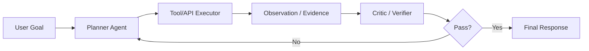

# LLM（Chapter 12）

> 主题：工具调用（Tool Use）与智能体系统（Agent Systems）

## 一句话理解

这节课是整门 LLM 课程的系统收束：模型不再只“回答问题”，而是通过 ReAct、Toolformer、AutoGen 等范式与工具、人类和其他智能体协作，形成可执行、可迭代、可验证的复合智能系统。

---

## 本讲核心问题

- 为什么“只靠模型参数”不足以解决复杂现实任务？
- ReAct 如何把推理（Reasoning）与行动（Acting）闭环起来？
- Toolformer 如何学习“何时用工具、用什么工具、怎么用”？
- 多智能体编排（Multi-agent Orchestration）的关键设计维度是什么？

---

## 1. 从 Tool Use 到 Agent：能力边界的外扩

课程强调，纯语言模型常见瓶颈包括：

- 时效性知识不足
- 精确计算与外部执行能力不足
- 长链任务中的稳定性不足

通过工具调用，模型可以把部分子任务外包给外部系统（搜索、计算器、代码执行器、数据库、API）。  
通过 Agent 编排，可以把复杂任务拆成“规划-执行-验证-反思”的流程。

一句话理解：把“模型能力”升级为“系统能力”。

---

## 2. ReAct：推理-行动交替循环

ReAct 的核心是交替生成：

1. Thought（内部推理）
2. Action（外部动作）
3. Observation（环境反馈）

再根据反馈进入下一轮推理与行动。  
课件的消融结果说明：

- 只 Reason 不 Act：容易脱离事实、产生幻觉
- 只 Act 不 Reason：动作有了但难以完成长程推理
- 二者结合：可解释性、事实性和任务成功率更均衡

---

## 3. Toolformer：让模型自学工具调用

Toolformer 路线的目标是学习三件事：

- Which tool：选什么工具
- When to use：何时调用
- How to use：如何构造调用参数

典型流程：

1. 生成候选 API 调用
2. 执行调用并拿到返回
3. 依据语言建模收益过滤样本
4. 用筛选后的工具使用数据微调模型

常见过滤准则可写成“调用后损失下降”：

  $$
  \Delta \mathcal{L}
  =
  \mathcal{L}_{\text{no-tool}}-\mathcal{L}_{\text{with-tool}},
  \qquad
  \Delta \mathcal{L} > \tau \Rightarrow \text{keep}.
  $$

---

## 4. Agentic Frameworks（以 AutoGen 为代表）

课程总结了 Agent 框架的几个关键抽象：

- 角色（roles）：Planner、Executor、Critic、User proxy
- 通信（conversation）：消息驱动协作
- 工具（tool use）：函数/API/代码环境调用
- 反思（reflection）：自我修正与回退
- 编排（orchestration）：静态或动态多智能体协作

多智能体编排常见设计维度：

| 维度     | 选项示例              |
| -------- | --------------------- |
| 拓扑     | 静态流程 / 动态路由   |
| 记忆     | 上下文共享 / 隔离记忆 |
| 协作关系 | 合作 / 竞争           |
| 控制方式 | 人类干预 / 全自动     |

---

## 5. HuggingGPT 与 Generative Agents：两个代表方向

### 5.1 HuggingGPT

用 LLM 作为统一语言接口，调度多个专用模型（感知、生成、推理）完成复杂多模态任务。

### 5.2 Generative Agents

强调“长期记忆 + 反思 + 规划”的社会化智能体行为模拟，适合多角色互动与长期任务环境。

一句话理解：前者偏“工具编排平台”，后者偏“行为体模拟系统”。

---

## 6. Agent 程序的目标函数直觉

把智能体看作策略 \(\pi\)，目标是最大化任务效用并控制成本与风险：

  $$
  \max_{\pi}\ 
  \mathbb{E}\big[
  U(\text{task success})
  -\lambda_c C(\text{tool cost})
  -\lambda_r R(\text{safety risk})
  \big].
  $$

这解释了为什么真实系统需要“性能-延迟-费用-安全”的联合权衡。

---

## 7. 端到端流程图（Tool + Agent）

---

## 常见误区

### 误区 1：有了 Agent 就不需要高质量基础模型

不对。系统编排放大上限，也会放大基础模型缺陷。

### 误区 2：工具调用越多越好

不对。过度调用会增加成本、时延和错误传播链。

### 误区 3：多智能体一定优于单智能体

不对。任务简单时，多智能体会带来额外协调开销。

---

## 本讲小结

- ReAct、Toolformer、AutoGen 共同定义了“从模型到系统”的技术主线。
- 工具调用解决“能力扩展”，智能体编排解决“流程可靠”。
- LLM 应用的未来竞争力，核心在可组合、可验证、可治理的 Agent 系统工程。
