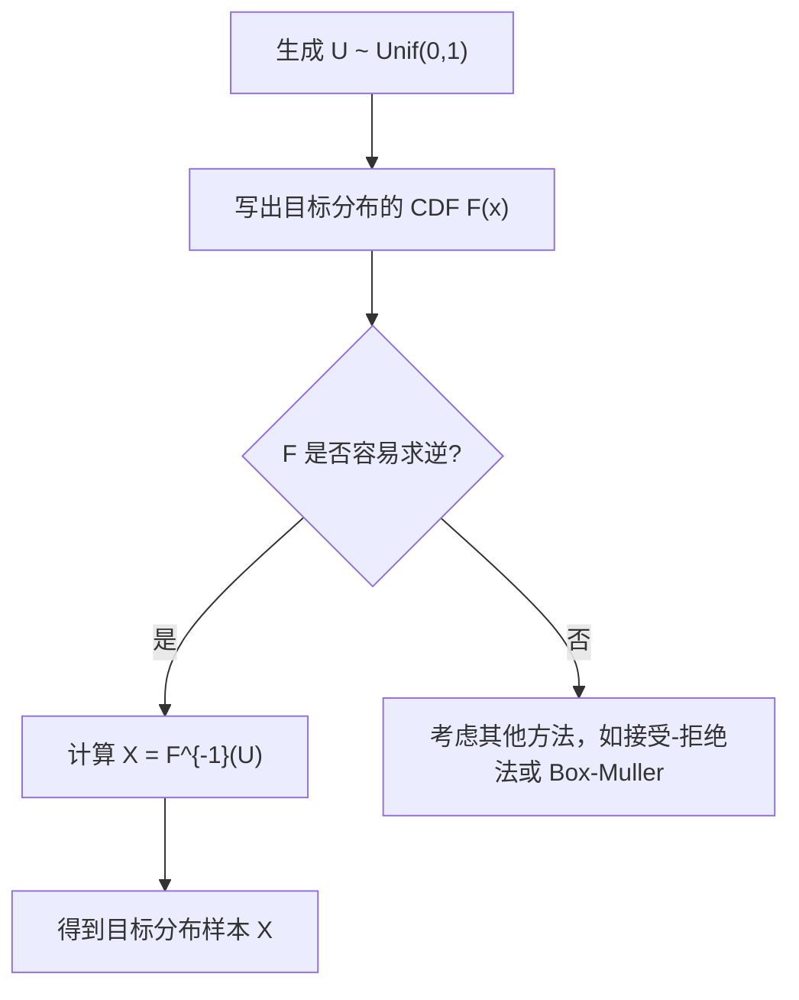

# 蒙特卡洛模拟（Lecture 1）

> 资料来源：课程课件 `Jan 25`（FTEC 5220 Monte Carlo Simulation in Finance）  
> 主题：随机变量生成（Random Variable Generation）、逆变换法（Inverse Transform Method）、分位数（Quantile）直觉

## 一句话理解

这节课的核心是在讲：**如果我们已经会生成均匀分布（Uniform Distribution）随机数，那么很多别的分布都可以通过“变换”生成出来；逆变换法就是最基本、最通用的一条起点。**

---

## 本节讲了什么

第一讲可以分成三层：

1. 课程全景：这门课会从金融中的蒙特卡洛模拟出发，覆盖随机变量生成、衍生品定价、方差缩减（Variance Reduction）、罕见事件模拟（Rare Event Simulation）和马尔可夫链蒙特卡洛（Markov Chain Monte Carlo, MCMC）。
2. 技术起点：任何模拟都离不开“先生成随机数”，尤其是从均匀分布出发构造目标分布样本。
3. 第一种基本方法：逆变换法，核心思想是“先抽一个随机分位数，再把它映射回目标分布上的取值”。

---

## 为什么重要

蒙特卡洛模拟的本质，是把一个难以解析计算的问题，转化为“反复采样 + 求平均”的问题。  
而采样是否正确，决定了整个模拟结果是否可信。

如果这一层没有建立好，后面无论是：

- 模拟几何布朗运动（Geometric Brownian Motion）
- 估计期权价格（Option Pricing）
- 计算信用风险尾部损失（Tail Risk）
- 还是做贝叶斯推断（Bayesian Inference）

都会失去基础。

---

## 课程结构速览

从课件首页看，这门课大致按下面的结构展开：

| 模块 | 主题 |
| --- | --- |
| Topic 1 | 随机变量生成与期望计算 |
| Topic 2 | 用模拟做金融衍生品定价 |
| Topic 3 | 方差缩减方法 |
| Topic 4 | 罕见事件模拟 |
| Topic 5 | 马尔可夫链蒙特卡洛 |

本讲真正进入的是 `Topic 1` 的开头部分。

---

## 概念拆解

### 1. 为什么总是从均匀分布开始

计算机最容易稳定地产生的是区间 $[0,1]$ 上的均匀随机数。  
因此很多模拟算法都默认我们已经拿到了独立同分布的：

\[
U_1, U_2, \dots \overset{i.i.d.}{\sim} \mathrm{Unif}(0,1).
\]

于是问题变成：

> 已知我们会生成均匀分布随机数，怎样把它“变形”为目标分布？

这正是逆变换法与接受-拒绝法（Acceptance-Rejection Method）要解决的问题。

### 2. 分布函数与分位数

对于随机变量 $X$，其分布函数（Cumulative Distribution Function, CDF）定义为：

\[
F(x) = \mathbb{P}(X \le x).
\]

如果 $F$ 严格递增，那么反函数 $F^{-1}$ 存在。  
这时 $F^{-1}(u)$ 可以理解为“第 $u$ 分位点（quantile）”。

### 3. 逆变换法的直觉

逆变换法不是“直接猜一个 $X$”，而是：

1. 先随机抽一个百分位 $U \sim \mathrm{Unif}(0,1)$
2. 再把这个百分位映射回目标分布的数值轴

即

\[
X = F^{-1}(U).
\]

这就是“随机分位数（Random Quantile）”的视角。

---

## 数学上怎么表达

### 均匀分布的分布函数

若 $U \sim \mathrm{Unif}(0,1)$，则其分布函数为：

\[
F_U(u)=
\begin{cases}
0, & u < 0, \\
u, & 0 \le u \le 1, \\
1, & u > 1.
\end{cases}
\]

### 逆变换法的核心命题

若随机变量 $X$ 的分布函数 $F$ 连续且严格递增，则

\[
U = F(X) \sim \mathrm{Unif}(0,1).
\]

反过来，若

\[
U \sim \mathrm{Unif}(0,1),
\]

则

\[
X = F^{-1}(U)
\]

服从分布函数 $F$。

### 证明的关键一行

对任意 $u \in [0,1]$，

\[
\begin{aligned}
\mathbb{P}(U \le u)
&= \mathbb{P}(F(X)\le u) \\
&= \mathbb{P}(X \le F^{-1}(u)) \\
&= F(F^{-1}(u)) \\
&= u.
\end{aligned}
\]

因此 $U$ 的分布函数就是 $u$ 本身，也就是均匀分布。

---

## 实际上怎么理解

### 20% 分位和 90% 分位为什么都“同样可能”

如果 $U$ 真的是均匀分布，那么：

\[
\mathbb{P}(0.2 \le U \le 0.3)=0.1
\]

同时

\[
\mathbb{P}(0.85 \le U \le 0.95)=0.1
\]

这表示：随机变量落在“20%-30% 分位区间”和落在“85%-95% 分位区间”的概率一样，都是 10%。  
所以先抽一个分位数，再映射成实际取值，是非常自然的思路。

### 一句话理解

**逆变换法不是在随机数轴上乱抽点，而是在概率轴上均匀抽位置。**

---

## 当分布函数不严格递增时怎么办

真实问题里，$F$ 不一定严格递增：

- 可能有跳跃：离散分布（Discrete Distribution）
- 可能有平坦区间：某些区间没有概率质量

这时普通反函数未必存在，所以要用广义逆（Generalized Inverse）：

\[
F^{-1}(u) = \inf \{x : F(x) \ge u\}.
\]

这里的 $\inf$ 是下确界（infimum）。

### 它解决了什么问题

| 情况 | 问题 | 广义逆如何处理 |
| --- | --- | --- |
| 跳跃点 | 多个概率质量集中在一点 | 选中对应跳跃所在位置 |
| 平坦区间 | 同一个 $u$ 可能对应一整段区间 | 取最左端点 |

### 为什么这很重要

因为现实中很多分布都不是“完美光滑且严格递增”的。  
如果不引入广义逆，逆变换法只能用于非常理想化的连续分布。

---

## 例子 1：标准正态分布

若 $X \sim N(0,1)$，其分布函数记作 $\Phi(x)$，则：

\[
X = \Phi^{-1}(U), \qquad U \sim \mathrm{Unif}(0,1).
\]

这告诉我们：  
只要能够计算或近似标准正态分布的逆分布函数，就能从均匀随机数生成正态随机数。

### 常见误区

很多人第一次接触时会以为：

> 既然正态分布这么常见，模拟正态分布就一定直接用逆变换法。

其实不一定。  
因为 $\Phi^{-1}$ 没有简单闭式，实际计算里常常会用 Box-Muller 方法（Box-Muller Method）或别的数值方法。

---

## 例子 2：指数分布

课件中给了一个非常经典的例子：指数分布（Exponential Distribution）。

若 $X$ 的均值为 $\theta$，则其分布函数可写为：

\[
F(x)=1-e^{-x/\theta}, \qquad x \ge 0.
\]

令 $U = F(X)$，反解得：

\[
X = -\theta \ln(1-U).
\]

由于 $U$ 与 $1-U$ 同分布，通常直接写成：

\[
X = -\theta \ln U.
\]

### 为什么这个例子重要

这是逆变换法最常用、最干净的例子之一。  
它也说明：如果分布函数容易求逆，采样算法会非常直接。

### 物理 / 金融直觉

指数分布常用来描述泊松过程（Poisson Process）中相邻跳跃之间的等待时间（Waiting Time）。  
也就是说，“随机事件的间隔时间”常常可以这样模拟。

---

## 例子 3：反正弦分布

课件还提到布朗运动（Brownian Motion）相关的反正弦律（Arcsine Law）例子。  
若某个随机变量的分布函数为：

\[
F(x)=\frac{2}{\pi}\sin^{-1}(\sqrt{x}), \qquad 0 < x < 1,
\]

则逆变换给出：

\[
X = \sin^2\left(\frac{\pi U}{2}\right), \qquad U \sim \mathrm{Unif}(0,1).
\]

利用三角恒等式还能化成等价形式：

\[
X = \frac{1-\cos(\pi U)}{2}.
\]

### 这个例子想说明什么

它说明逆变换法不仅适用于“教科书里的基础分布”，也能适用于一些金融数学和随机过程里出现的特殊分布。

---

## 计算机里的起点：均匀随机数怎么来

课件附录还简单回顾了线性同余生成器（Linear Congruential Generator, LCG）。  
它的递推形式通常写作：

\[
X_{n+1} = (aX_n + c) \bmod m,
\]

再归一化为

\[
U_{n+1} = \frac{X_{n+1}}{m}.
\]

### 这部分的重点不是“手写随机数生成器”

而是提醒我们：

- 蒙特卡洛方法默认有随机数输入
- 但伪随机数（Pseudo-random Number）质量并不是理所当然的
- 周期（Period）太短，会直接影响模拟质量

### 常见误区

> “只要看起来够随机就行。”

不够。  
在大规模模拟里，随机数序列的周期性、相关性和维度表现都会影响结果，尤其在金融工程这类对尾部和误差很敏感的任务里更明显。

---

## 方法流程

---

## 常见误解

### 误解 1：逆变换法总是最优方法

不是。  
逆变换法是最基础、最有解释力的方法，但并不总是数值上最便宜。

### 误解 2：只要知道密度函数就能直接采样

不对。  
知道密度函数（Density Function）不等于知道其分布函数的反函数。  
很多时候正是因为“逆不出来”，才需要接受-拒绝法等替代方案。

### 误解 3：连续分布才配用逆变换法

也不完全对。  
如果使用广义逆，离散分布和带平坦区间的分布同样可以处理。

### 误解 4：随机数生成只是工程细节

不是。  
它是整个蒙特卡洛框架最底层的数学假设之一。

---

## 本节小结

### 核心结论

- 蒙特卡洛模拟的第一步是可靠地产生随机样本
- 实务上通常从均匀分布随机数开始
- 逆变换法的核心是：

\[
X = F^{-1}(U), \qquad U \sim \mathrm{Unif}(0,1)
\]

- 它背后的直觉是“随机抽分位数”
- 当 $F$ 不严格递增时，用广义逆替代普通反函数

### 这一讲真正建立的直觉

**概率轴上的均匀采样，可以转化成目标分布上的正确采样。**

---

## 可继续思考的问题

1. 为什么有些分布适合逆变换法，有些分布更适合接受-拒绝法？
2. 如果 $\Phi^{-1}$ 没有简单闭式，为什么正态分布模拟仍然如此高效？
3. 在金融模拟里，伪随机数质量会如何影响价格估计与风险估计？
4. 广义逆和风险管理中的 VaR（Value at Risk）为什么会自然联系起来？
