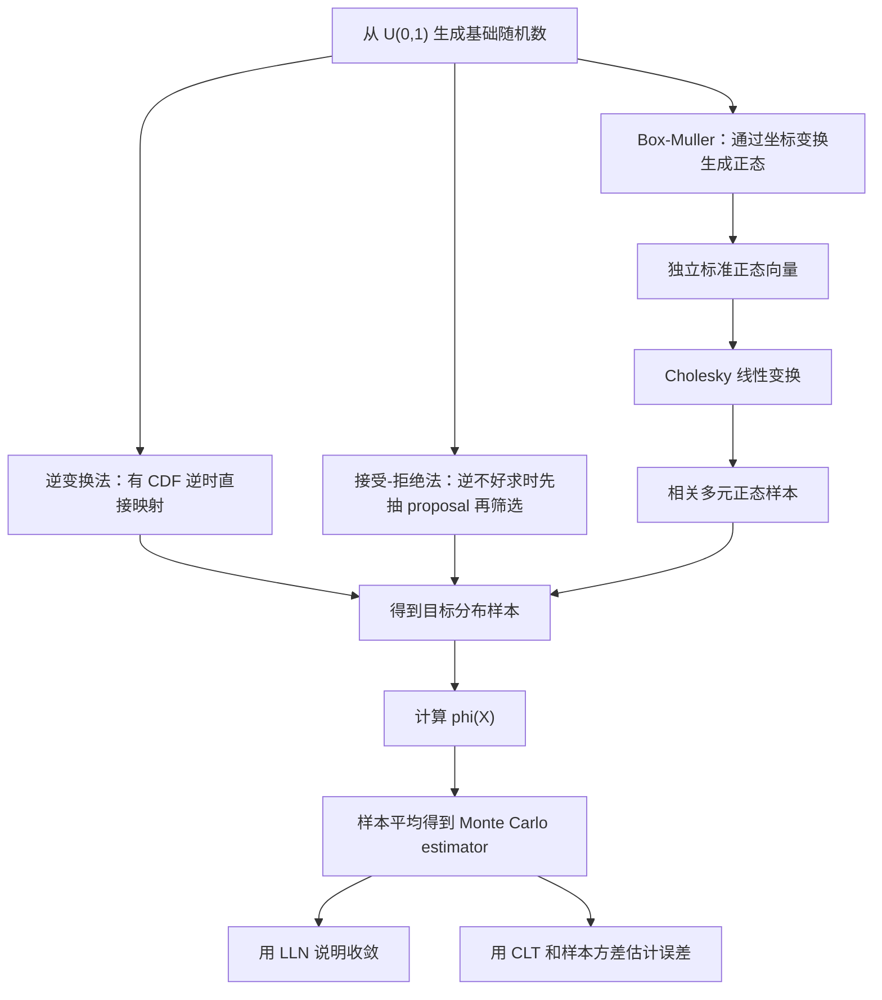

# 蒙特卡洛模拟（Topic 1）

> 资料来源：`Simulation_Topic1.pdf`  
> 主题：采样方法（Sampling Methods）、随机变量生成（Random Variable Generation）、蒙特卡洛估计（Monte Carlo Estimation）

## 一句话理解

Topic 1 讨论的是蒙特卡洛模拟最底层的两件事：**如何正确生成目标分布的随机样本，以及如何把“反复采样”变成对期望和积分的数值估计。**

---

## 这个 Topic 在整门课中的位置

这门课后续会讨论：

- 如何用模拟做金融衍生品定价
- 如何降低模拟方差
- 如何处理罕见事件
- 如何做马尔可夫链蒙特卡洛（Markov Chain Monte Carlo, MCMC）

但这些内容都建立在同一个前提上：

> 你必须先会“生成你想要的随机变量”，并且知道“模拟均值为什么会收敛、误差怎么衡量”。

所以 Topic 1 是整门课的基础设施层。

---

## 本 Topic 讲了什么

从课件结构来看，Topic 1 可以整理成五个部分：

| 小节 | 内容 |
| --- | --- |
| 1.1 | 逆变换法（Inverse Transform Method） |
| 1.2 | 接受-拒绝法（Acceptance-Rejection Method） |
| 1.3 | Box-Muller 方法生成正态分布 |
| 1.4 | 用 Cholesky 分解生成多元正态分布 |
| 1.5 | 用模拟计算期望、积分、方差与置信区间 |

如果要把它概括成一句话，就是：

> 从均匀随机数出发，构造复杂分布样本，再把样本平均变成数值答案。

---

## 为什么重要

蒙特卡洛方法的基本形式是：

1. 先从某个分布采样
2. 再计算目标函数值
3. 最后做样本平均

如果第一步采样错了，后面所有均值、价格、风险指标都会错。  
如果第三步不知道误差怎么缩小、置信区间怎么解释，那模拟结果也很难用于分析或决策。

所以这个 Topic 实际上在回答两个核心问题：

1. 如何从简单分布生成复杂分布？
2. 如何判断模拟估计值是否可信？

---

## 一、逆变换法：从分位数生成随机变量

### 核心想法

逆变换法（Inverse Transform Method）的出发点是：

- 计算机容易生成 $[0,1]$ 上的均匀随机数
- 如果目标分布函数（Cumulative Distribution Function, CDF）可逆，就能把均匀随机数映射成目标分布样本

### 基本公式

对于均匀随机变量 $U \sim \mathrm{Unif}(0,1)$，其分布函数为：

  $$
  F_U(u)=
  \begin{cases}
  0, & u < 0, \\
  u, & 0 \le u \le 1, \\
  1, & u > 1.
  \end{cases}
  $$

若目标随机变量 $X$ 的分布函数为 $F$，且 $F$ 严格递增，则：

  $$
  U = F(X) \sim \mathrm{Unif}(0,1).
  $$

反过来有：

  $$
  X = F^{-1}(U), \qquad U \sim \mathrm{Unif}(0,1).
  $$

### 数学直觉

这里最重要的直觉不是“函数求逆”，而是：

> 先随机选一个分位数（quantile / percentile），再把这个分位数映射回数轴上的真实取值。

所以逆变换法本质上是在做“随机分位数抽样”。

### 关键证明

对任意 $u \in [0,1]$，

  $$
  \begin{aligned}
  \mathbb{P}(U \le u)
  &= \mathbb{P}(F(X)\le u) \\
  &= \mathbb{P}(X \le F^{-1}(u)) \\
  &= F(F^{-1}(u)) \\
  &= u.
  \end{aligned}
  $$

因此 $U$ 的分布函数就是均匀分布本身。

### 一句话理解

**逆变换法是在概率轴上均匀取点，而不是在数值轴上随便取点。**

---

## 二、广义逆：为什么逆变换法不只适用于光滑分布

课件特别强调了一点：真实分布函数 $F(x)$ 不一定严格递增。

这会出现两类情况：

- 跳跃：对应离散概率质量
- 平台：对应某些区间没有概率质量

这时用普通反函数不够，需要使用广义逆（Generalized Inverse）：

  $$
  F^{-1}(u) = \inf\{x : F(x) \ge u\}.
  $$

### 它解决了什么问题

| 情况 | 发生了什么 | 广义逆怎么处理 |
| --- | --- | --- |
| 跳跃点 | 同一个概率区间落到同一个取值上 | 返回该离散点 |
| 平台区间 | 同一个概率值可能对应一整段区间 | 取最左端点 |

### 为什么这很重要

这说明逆变换法并不只属于“连续可导分布”的世界。  
它的理论基础其实更宽，甚至和风险管理中的左分位函数、VaR（Value at Risk）是相通的。

---

## 三、逆变换法的典型例子

### 1. 标准正态分布

若 $X \sim N(0,1)$，其分布函数记作 $\Phi(x)$，则：

  $$
  X = \Phi^{-1}(U), \qquad U \sim \mathrm{Unif}(0,1).
  $$

这说明：只要你能数值求出正态分布的逆分布函数，就能从均匀分布生成正态分布。

### 2. 指数分布

课件中给出了最经典的逆变换法例子。  
若指数分布均值为 $\theta$，则

  $$
  F(x)=1-e^{-x/\theta}, \qquad x \ge 0.
  $$

反解得到：

  $$
  X = -\theta \ln(1-U).
  $$

因为 $U$ 与 $1-U$ 同分布，通常直接写成：

  $$
  X = -\theta \ln U.
  $$

### 3. 反正弦分布

在布朗运动（Brownian Motion）最大值达到时刻的例子中，课件给出：

  $$
  F(x)=\frac{2}{\pi}\sin^{-1}(\sqrt{x}), \qquad 0 \le x \le 1.
  $$

逆变换后可写成：

  $$
  X=\sin^2\left(\frac{\pi U}{2}\right)
  = \frac{1-\cos(\pi U)}{2}.
  $$

### 4. Rayleigh / Brownian bridge 例子

课件还展示了布朗桥（Brownian Bridge）最大值对应的一类分布，其逆变换最终需要解二次方程。  
这说明逆变换法不仅适用于“简单分布”，也适用于一些金融随机过程中的特殊分布，只是代数处理会更复杂。

---

## 四、接受-拒绝法：当分布函数不好求逆时怎么办

### 核心动机

逆变换法很漂亮，但前提是 $F^{-1}$ 容易求。  
很多密度函数虽然知道长什么样，却很难直接求逆，这时就会转向接受-拒绝法（Acceptance-Rejection Method）。

### 基本想法

如果目标密度是 $f(x)$，我们找一个更容易采样的 proposal density $g(x)$，并找到常数 $c$，使得：

  $$
  f(x) \le c\,g(x), \qquad \forall x.
  $$

然后算法是：

1. 从 $g$ 抽一个候选样本 $X$
2. 再抽一个 $U \sim \mathrm{Unif}(0,1)$
3. 若

  $$
  U \le \frac{f(X)}{c\,g(X)},
  $$

则接受；否则拒绝并重来

### 为什么它成立

接受机制设计成后，最终“被接受的样本分布”恰好恢复成目标分布 $f$。  
这相当于先从容易分布里多抽一些，再通过随机筛选把样本纠正回目标分布。

### 效率怎么看

课件强调两个重要结论：

- 接受概率大约是 $1/c$
- 平均需要约 $c$ 次尝试才能得到一个有效样本

所以：

> $c$ 越接近 1，proposal 越贴合目标分布，算法越高效。

### 课件中的例子

课件用接受-拒绝法讨论了：

- 在矩形中取点生成某个目标密度
- Beta 分布样本生成
- Gamma 分布样本生成
- 单位圆盘（unit disc）上的均匀分布样本生成

这些例子共同说明：  
接受-拒绝法的适用面很广，但效率高度依赖 proposal 的选取。

---

## 五、Poisson 过程与 Poisson 随机变量模拟

Topic 1 里还有一条非常金融工程化的主线：  
如何把指数分布（Exponential Distribution）和 Poisson 过程（Poisson Process）联系起来。

### 关键关系

- Poisson 过程的到达间隔时间服从指数分布
- 如果相邻到达时间独立且服从指数分布，那么计数过程就是 Poisson 过程

### 这件事为什么重要

因为它把“等待时间模拟”和“事件次数模拟”连起来了。  
在信用风险、跳跃过程、事件驱动金融模型里，这个联系非常常见。

### 课件给出的模拟思路

Poisson 随机变量可以理解为：

> 在单位时间内，最多能累加多少个独立的指数等待时间。

利用 $U_j \sim \mathrm{Unif}(0,1)$ 和指数变量表示式，可以把它转写成不断累积乘积，直到低于某个阈值为止的算法。

### 一句话理解

**Poisson 计数和指数等待时间，本质上是同一件随机机制的两种视角。**

---

## 六、Box-Muller 方法：为什么正态分布经常不用逆变换法

### 核心公式

若 $U_1,U_2 \overset{i.i.d.}{\sim} \mathrm{Unif}(0,1)$，则 Box-Muller 变换给出：

  $$
  Y_1 = \sqrt{-2\ln U_1}\cos(2\pi U_2), \qquad
  Y_2 = \sqrt{-2\ln U_1}\sin(2\pi U_2).
  $$

则 $Y_1,Y_2$ 是独立标准正态随机变量。

### 它的直觉

这不是“直接对正态分布求逆”，而是：

1. 先把二维标准正态改写成极坐标
2. 发现角度项可以由均匀分布给出
3. 半径平方项可以由指数分布给出
4. 再把它们重新拼回二维正态样本

### 为什么重要

这说明“生成正态分布”不一定要走 $\Phi^{-1}$。  
有时通过坐标变换，会得到更实用的算法。

---

## 七、多元正态生成：Cholesky 分解为什么是核心工具

在金融里，只生成一个正态变量通常不够。  
很多时候我们需要的是：

- 多资产收益率的联合模拟
- 相关风险因子的联合模拟
- 带协方差结构的高维正态向量

### 二维相关正态的基本构造

课件先从二维情形出发。若 $x_1,x_2$ 独立且标准正态，那么可以构造：

  $$
  \xi_1 = x_1, \qquad
  \xi_2 = \rho x_1 + \sqrt{1-\rho^2}\,x_2,
  $$

从而得到相关系数为 $\rho$ 的联合正态变量。

### 矩阵视角

更一般地，若协方差矩阵为 $\Sigma$，并且存在 Cholesky 分解：

  $$
  \Sigma = A A^\top,
  $$

其中 $A$ 为下三角矩阵，那么对独立标准正态向量 $Z$，令

  $$
  X = \mu + A Z,
  $$

就能得到均值为 $\mu$、协方差为 $\Sigma$ 的多元正态向量。

### 为什么重要

Cholesky 分解之所以关键，是因为它把“相关结构”转成了一个线性变换。  
所以流程变成：

1. 先生成独立标准正态
2. 再左乘一个矩阵
3. 就得到有指定相关性的样本

这在资产路径模拟中几乎是标准工具。

---

## 八、蒙特卡洛估计：样本平均为什么可以估计期望

### 目标

对于随机变量 $X$ 和函数 $\phi(X)$，我们想计算：

  $$
  \mu = \mathbb{E}[\phi(X)].
  $$

若 $X_1,\dots,X_n$ 独立同分布，则蒙特卡洛估计量定义为：

  $$
  \hat{\mu}_n = \frac{1}{n}\sum_{i=1}^n \phi(X_i).
  $$

### 两个最核心的理论结论

#### 1. 无偏性（Unbiasedness）

  $$
  \mathbb{E}[\hat{\mu}_n] = \mu.
  $$

#### 2. 强一致性（Strong Consistency）

  $$
  \hat{\mu}_n \xrightarrow{\text{a.s.}} \mu \qquad (n\to\infty).
  $$

这背后对应的是强大数定律（Strong Law of Large Numbers）。

### 方差与误差规模

若 $\sigma^2 = \mathrm{Var}(\phi(X))$ 存在，则：

  $$
  \mathrm{Var}(\hat{\mu}_n)=\frac{\sigma^2}{n}.
  $$

这意味着标准误差（standard error）的量级是：

  $$
  O\!\left(\frac{1}{\sqrt{n}}\right).
  $$

### 最重要的实际含义

误差不是按 $1/n$ 下降，而是按 $1/\sqrt{n}$ 下降。  
这意味着：

- 想把误差缩小到一半
- 往往要把样本量增加到 4 倍

这正是后面 Topic 3 里“方差缩减方法”存在的根本原因。

---

## 九、中心极限定理与置信区间

若 $\sigma^2 < \infty$，中心极限定理（Central Limit Theorem, CLT）告诉我们：

  $$
  \sqrt{n}\,\frac{\hat{\mu}_n-\mu}{\sigma}
  \xrightarrow{d} N(0,1).
  $$

因此大样本下可近似构造置信区间。

### 样本方差估计

课件还给出了无偏样本方差估计量：

  $$
  S_n^2
  =
  \frac{1}{n-1}\sum_{i=1}^n \bigl(\phi(X_i)-\hat{\mu}_n\bigr)^2.
  $$

于是可以把未知的 $\sigma$ 用样本标准差替代，得到经验置信区间。

### 一句话理解

**大数定律告诉你“会收敛”，中心极限定理告诉你“误差大概有多大”。**

---

## 十、积分为什么也能用蒙特卡洛来算

课件最后把积分问题写成期望问题。  
若 $U \sim \mathrm{Unif}(0,1)$，则

  $$
  \int_0^1 f(x)\,dx = \mathbb{E}[f(U)].
  $$

于是积分可以通过

  $$
  \hat{\mu}_n = \frac{1}{n}\sum_{i=1}^n f(U_i)
  $$

来估计。

### 这件事的意义

这一步非常关键，因为它把：

- 数学积分
- 概率期望
- 数值模拟

统一成了同一个框架。

在高维时，这种统一尤其重要，因为传统数值积分往往会遇到维数灾难，而蒙特卡洛误差阶仍保持在 $O(n^{-1/2})$。

---

## Topic 1 方法总图

---

## 常见误区

### 误区 1：只要能写出密度函数，就一定能轻松采样

不对。  
很多分布的难点恰恰在于“密度已知，但逆分布函数不好求”。

### 误区 2：逆变换法是唯一基础方法

也不对。  
一旦逆函数难求，接受-拒绝法、坐标变换法就会变得更实用。

### 误区 3：蒙特卡洛误差下降很快

并没有。  
它通常只有 $O(n^{-1/2})$ 的收敛速度，所以样本量的提升成本很高。

### 误区 4：相关正态样本只要“手动凑相关性”就行

不够严谨。  
必须保证构造后的协方差矩阵正确，多元正态生成的标准方式正是 Cholesky 分解。

---

## 本 Topic 小结

### 这一篇真正建立了什么

- 从均匀分布出发生成复杂随机变量
- 理解逆变换法与广义逆的统一逻辑
- 理解接受-拒绝法为什么适合“逆不好求”的场景
- 掌握 Box-Muller 生成正态样本的思想
- 掌握 Cholesky 分解生成相关多元正态样本
- 理解蒙特卡洛估计量的无偏性、一致性、误差阶与置信区间

### 一句话总括

**Topic 1 把“采样”和“估计”这两件事接起来，真正定义了蒙特卡洛模拟作为一种数值方法的基本骨架。**

---

## 可继续思考的问题

1. 什么时候应该优先用逆变换法，什么时候应改用接受-拒绝法？
2. Box-Muller 方法与直接使用正态逆分布函数相比，优劣分别是什么？
3. 为什么高维积分里蒙特卡洛方法常常比规则网格法更可行？
4. 如果误差只按 $1/\sqrt{n}$ 缩小，后续 Topic 3 的方差缩减为什么会变得必要？
