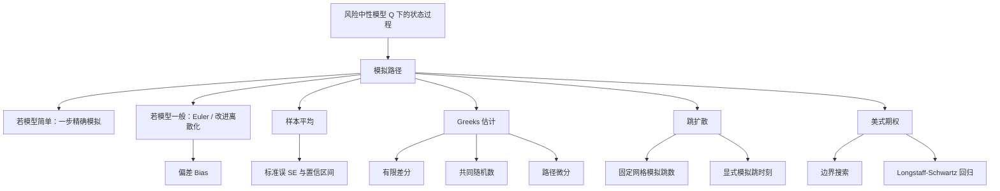

# 蒙特卡洛模拟（Topic 2）
> 资料来源：`Simulation_Topic2.pdf`  
> 主题：金融衍生品定价（Pricing Financial Derivatives）、随机微分方程离散化（SDE Discretization）、Greeks 估计、跳扩散（Jump Diffusion）、美式期权（American Options）

## 一句话理解

Topic 2 讨论的是：**当目标从“会采样”变成“会定价”时，怎样把随机路径、贴现现金流、误差分解和最优执行决策整合成一套真正能用于金融衍生品估值的 Monte Carlo 框架。**

---

## 本 Topic 在整门课中的位置

Topic 1 解决的是“如何生成随机样本、如何做样本平均”。  
Topic 2 往前走了一步，开始回答金融里真正关心的问题：

- 如何把资产价格写成风险中性（Risk-Neutral）下的随机过程
- 如何模拟整条路径，而不只是一个终点
- 如何定价欧式（European）和路径依赖（Path-Dependent）产品
- 如何估计敏感度指标（Greeks）
- 如何处理跳跃风险和提前执行

可以把 Topic 2 看成是“Monte Carlo 从概率工具变成定价引擎”的一章。

---

## 本 Topic 讲了什么

从课件结构来看，Topic 2 可以整理成四个模块：

| 模块 | 内容 |
| --- | --- |
| 2.1 | 随机微分方程（Stochastic Differential Equations, SDE）模拟：Euler scheme、偏差与标准误、精确模拟、Lamperti 变换 |
| 2.2 | Greeks 的 Monte Carlo 估计：有限差分、共同随机数（Common Random Numbers）、路径微分（Pathwise Differentiation） |
| 2.3 | 跳扩散模型（Jump Diffusion Models）：Poisson 跳、固定时点模拟、随机跳时刻模拟 |
| 2.4 | 美式期权估值：Grant-Vora-Weeks 边界法、Longstaff-Schwartz 回归法 |

如果只保留主线，就是：

> 先在风险中性测度下模拟价格路径，再把贴现后的现金流沿路径求值，最后处理误差、敏感度与提前执行问题。

---

## 为什么重要

很多衍生品并没有简单闭式公式。尤其当模型或 payoff 稍微复杂一点时，解析解往往就不再现实。

典型困难包括：

- payoff 依赖整条路径，而不是终点
- 标的可能是多资产、相关结构复杂
- 需要的不只是价格，还要 Delta、Vega 等敏感度
- 价格过程可能带跳跃
- 美式期权涉及“现在行权还是继续持有”的最优停止（Optimal Stopping）问题

所以 Topic 2 的核心价值在于：**它把“随机过程建模”和“数值定价”真正接到一起。**

---

## 一、风险中性定价与 Monte Carlo 的基本框架

### 核心目标

欧式衍生品定价通常可写成某个期望：

  $$
  \mathbb{E}^{\mathbb{Q}}_t\bigl[f(Z(T;t,z))\bigr].
  $$

这里：

- $Z$ 表示风险中性测度 $\mathbb{Q}$ 下的状态变量过程
- $z$ 是时刻 $t$ 的初值
- $f$ 给出到期时的 payoff

对于贴现后的价格，常见写法是：

  $$
  V_t = e^{-r(T-t)}\mathbb{E}^{\mathbb{Q}}_t[\text{payoff at }T].
  $$

### 三步法

在衍生品定价语境下，Monte Carlo 的流程非常标准：

1. 在风险中性测度下模拟标的状态变量路径
2. 对每条路径计算贴现现金流
3. 对所有路径求样本平均

### 一句话理解

**定价问题被改写成“贴现随机现金流的期望”，而 Monte Carlo 正是估计期望的工具。**

---

## 二、SDE 模拟：Euler scheme、偏差与标准误

### 一般形式

课件从一维随机微分方程出发：

  $$
  dX_t = b(t,X_t)\,dt + \sigma(t,X_t)\,dW_t.
  $$

其中：

- $b(t,X_t)$ 是漂移项（Drift）
- $\sigma(t,X_t)$ 是波动项（Volatility）
- $W_t$ 是布朗运动（Brownian Motion）

### Euler 离散化

若将时间网格离散为

  $$
  0=t_0<t_1<\cdots<t_m=T,
  $$

Euler 近似写成：

  $$
  \hat X_{t_{i+1}}
  =
  \hat X_{t_i}
  +
  b(t_i,\hat X_{t_i})(t_{i+1}-t_i)
  +
  \sigma(t_i,\hat X_{t_i})\sqrt{t_{i+1}-t_i}\,Z_{i+1},
  $$

其中 $Z_{i+1}\overset{i.i.d.}{\sim}N(0,1)$。

### 误差分解

如果我们希望估计

  $$
  v=\mathbb{E}[h(X_T)],
  $$

而实际使用的是离散近似 $\hat X_T$，那么估计量通常是

  $$
  \hat v=\frac{1}{n}\sum_{i=1}^n h(\hat X_T^{(i)}).
  $$

这时会出现两个不同层面的误差：

| 误差来源 | 含义 | 增加样本条数能否解决 |
| --- | --- | --- |
| 偏差（Bias） | 用 $\hat X$ 代替真过程 $X$ 带来的离散化误差 | 不能 |
| 方差（Variance） | 有限样本平均带来的随机波动 | 能 |

### MSE 公式

课件明确强调均方误差（Mean Squared Error, MSE）分解：

  $$
  \mathrm{MSE}(\hat\theta)
  =
  \mathbb{E}\bigl[(\hat\theta-\theta)^2\bigr]
  =
  \mathrm{Bias}^2(\hat\theta)+\mathrm{Var}(\hat\theta).
  $$

### 常见误解

**误解：只要模拟次数够多，误差就会消失。**

不对。  
如果离散化本身是有偏的，那么样本数 $n\to\infty$ 之后，收敛到的是 $\mathbb{E}[h(\hat X_T)]$，而不一定是真正的 $\mathbb{E}[h(X_T)]$。

### 一句话理解

**路径模拟里最关键的不是“多跑一些路径”这么简单，而是先分清你面对的是偏差问题还是方差问题。**

---

## 三、欧式期权定价：一个最标准的 Monte Carlo 模板

### Black-Scholes 下的价格动态

在风险中性测度下，几何布朗运动（Geometric Brownian Motion, GBM）满足：

  $$
  \frac{dS_t}{S_t}=(r-q)\,dt+\sigma\,dB_t,
  $$

等价地，

  $$
  d\ln S_t = \left(r-q-\frac{\sigma^2}{2}\right)dt+\sigma\,dB_t.
  $$

因此一步模拟可写成：

  $$
  S_{t+\Delta t}
  =
  S_t
  \exp\left[
    \left(r-q-\frac{\sigma^2}{2}\right)\Delta t
    +
    \sigma\sqrt{\Delta t}\,Z
  \right],
  \qquad Z\sim N(0,1).
  $$

### 欧式看涨期权

若 payoff 为 $(S_T-K)^+$，则价格估计量为：

  $$
  \hat C
  =
  e^{-rT}\frac{1}{M}\sum_{i=1}^M (S_T^{(i)}-K)^+.
  $$

### 标准误与置信区间

若每条路径对应的贴现 payoff 记为 $c_i$，则样本均值为

  $$
  \bar c = \frac{1}{M}\sum_{i=1}^M c_i.
  $$

样本方差可写成：

  $$
  s^2
  =
  \frac{1}{M-1}
  \left(
  \sum_{i=1}^M c_i^2 - M\bar c^2
  \right),
  $$

于是标准误（Standard Error）估计为：

  $$
  \mathrm{SE}(\bar c)\approx \frac{s}{\sqrt{M}}.
  $$

对应的近似置信区间：

  $$
  \bar c \pm z_{\alpha/2}\frac{s}{\sqrt{M}}.
  $$

### 最重要的数量级

课件再次强调了 Monte Carlo 最著名、也最“残酷”的收敛速度：

  $$
  \mathrm{SE}=O(M^{-1/2}).
  $$

这意味着：

- 想把误差减半，需要 4 倍样本
- 想把误差缩小到原来的十分之一，需要 100 倍样本

### 为什么欧式 vanilla 反而不一定最适合 Monte Carlo

因为对于只依赖终点 $S_T$ 的欧式产品，往往可以一步直接模拟到终点。  
Monte Carlo 更有优势的场景，反而是：

- 路径依赖期权（如 Asian、Lookback）
- 多资产产品
- 高维状态空间

---

## 四、精确模拟、计算效率与 Lamperti 变换

### 精确模拟（Exact Simulation）

对于某些特殊模型，可以把 SDE 积分后直接写出一步分布，从而避免离散化误差。

例如若

  $$
  dX_t = r\,dt+\sigma(t)\,dW_t,
  $$

则

  $$
  X_T = X_0 + rT + \left(\int_0^T \sigma^2(t)\,dt\right)^{1/2} Z,
  \qquad Z\sim N(0,1).
  $$

这里没有 Euler 那种时间离散偏差。

### 计算效率（Computational Efficiency）

课件很实用的一点是把“方差更小”和“总计算时间更少”放到同一个框架里比较。

若方法 1 和方法 2 每条路径的工作量分别为 $W_1,W_2$，对应单路径标准差分别为 $\sigma_1,\sigma_2$，在相同总工作量 $W_T$ 下，它们的标准误大致比较为：

  $$
  \mathrm{SE}_1 \propto \sigma_1\sqrt{\frac{W_1}{W_T}},
  \qquad
  \mathrm{SE}_2 \propto \sigma_2\sqrt{\frac{W_2}{W_T}}.
  $$

因此方法 1 优于方法 2 的判据可以写成：

  $$
  \sigma_1^2 W_1 < \sigma_2^2 W_2.
  $$

### 一句话理解

**更复杂的方法只有在“单位计算成本带来的误差下降”足够明显时，才真正值得用。**

### Lamperti 变换（Lamperti Transform）

当扩散系数 $\sigma(x)$ 不是常数时，Euler scheme 的表现往往会变差。Lamperti 变换的思路是先把过程变成“常波动”形式再做 Euler。

设

  $$
  dX_t=b(X_t)\,dt+\sigma(X_t)\,dW_t,
  $$

定义

  $$
  F(x)=\int \frac{1}{\sigma(x)}\,dx,
  \qquad
  Y_t = F(X_t).
  $$

则变换后过程满足

  $$
  dY_t = a(Y_t)\,dt + dW_t,
  $$

也就是波动系数变成了 1。

### 直觉

Lamperti 不是在“提高样本数”，而是在“把原问题改写成更适合离散化的坐标系”。

---

## 五、Greeks 的 Monte Carlo 估计

### Greeks 是什么

设期权价值为 $V=V(S,r,\sigma,t)$，常见 Greeks 包括：

| 名称 | 记号 | 含义 |
| --- | --- | --- |
| Delta | $\partial V/\partial S$ | 对标的价格的敏感度 |
| Gamma | $\partial^2 V/\partial S^2$ | 对 Delta 变化率的敏感度 |
| Vega | $\partial V/\partial \sigma$ | 对波动率的敏感度 |
| Rho | $\partial V/\partial r$ | 对利率的敏感度 |
| Theta | $\partial V/\partial t$ | 对时间的敏感度 |

### 有限差分法

最直接的做法是中心差分：

  $$
  V'(\theta)
  \approx
  \frac{V(\theta+h)-V(\theta-h)}{2h}.
  $$

但实际 Monte Carlo 中用的是估计值：

  $$
  \widehat{V'(\theta)}
  =
  \frac{\hat V(\theta+h)-\hat V(\theta-h)}{2h}.
  $$

### 有限差分的两难

课件强调这里存在经典 trade-off：

- $h$ 取大：截断误差大，偏差大
- $h$ 取小：两个价格估计非常接近，相减后再除以小数，数值不稳定，方差会被放大

中心差分的偏差量级来自 Taylor 展开：

  $$
  \mathrm{Bias}
  \approx
  \frac{1}{6}V^{(3)}(\theta)h^2.
  $$

### 共同随机数（Common Random Numbers）

为降低方差，可以在计算 $\hat V(\theta+h)$ 和 $\hat V(\theta-h)$ 时使用同一组随机数，而不是两套独立随机数。

它的直觉非常直接：

> 如果两个估计共享同一组随机扰动，那么相减时，很多共同噪声会被抵消。

这对 Delta 估计尤其重要，因为 Delta 本质上就是“两个很接近价格的差商”。

### 路径微分（Pathwise Differentiation）

除了“先估价再做差分”，还可以直接对 payoff 对参数求导，再对这个导数取期望。

如果可交换微分与期望，那么

  $$
  V'(\theta)
  =
  \frac{d}{d\theta}\mathbb{E}[X(\theta)]
  =
  \mathbb{E}\left[\frac{\partial X(\theta)}{\partial \theta}\right].
  $$

这类方法通常更稳定，也常能给出无偏估计。

### 一句话理解

**Greeks 估计不是“价格估计再顺手微分一下”这么简单，真正困难在于微分会把 Monte Carlo 噪声放大。**

---

## 六、跳扩散模型：当价格路径不再连续

### 为什么要引入跳跃

真实市场里，资产收益常出现：

- 尖峰厚尾（Leptokurtic）
- 突发公告后的价格断裂
- 单靠连续布朗扩散难以解释的大跳动

所以课件引入了 Merton 跳扩散模型（Merton Jump-Diffusion Model）。

### 模型结构

价格过程写成：

  $$
  \frac{dS(t)}{S(t^-)}
  =
  \mu\,dt+\sigma\,dW(t)+dJ(t),
  $$

其中 $J(t)$ 是跳过程，通常写成复合 Poisson 过程（Compound Poisson Process）：

  $$
  J(t)=\sum_{j=1}^{N(t)}(Y_j-1).
  $$

这里：

- $N(t)$ 是强度为 $\lambda$ 的 Poisson 过程
- $Y_j$ 是第 $j$ 次跳跃的乘数
- $S(t^-)$ 表示跳前的左极限值

### 跳跃的乘法结构

在跳时刻 $\tau_j$，有

  $$
  S(\tau_j)=S(\tau_j^-)\,Y_j.
  $$

因此在对数下会变成加法：

  $$
  \ln S(\tau_j)=\ln S(\tau_j^-)+\ln Y_j.
  $$

### 两种模拟思路

| 方法 | 思路 | 优点 | 局限 |
| --- | --- | --- | --- |
| 固定时点模拟 | 在每个时间区间内模拟跳数与累计跳幅 | 实现简单，适合按时间网格推进 | 不直接给出具体跳时刻 |
| 随机跳时刻模拟 | 直接模拟到达时刻 $\tau_1,\tau_2,\dots$ | 更贴近跳过程本身 | 事件管理更复杂 |

若到达间隔服从指数分布（Exponential Distribution），则

  $$
  R_{j+1} = -\frac{\ln U}{\lambda},
  \qquad
  U\sim \mathrm{Unif}(0,1).
  $$

### 一句话理解

**跳扩散是在连续扩散上再叠加“离散事件冲击”，用来捕捉纯布朗模型解释不了的突变风险。**

---

## 七、美式期权：为什么模拟比欧式难得多

### 根本困难

欧式期权只需要看到期 payoff。  
美式期权则要在每个可执行时点比较：

- 立刻执行值（Exercise Value）
- 继续持有值（Continuation Value）

动态规划方程写成：

  $$
  V_n(S)=\max\{h_n(S),\,H_n(S)\},
  $$

其中：

- $h_n(S)$ 是当期执行 payoff
- $H_n(S)$ 是继续持有的条件期望

### 为什么 forward simulation 不够

因为当你正向模拟一条路径时，走到某个点并不知道“现在执行是否最优”，除非你已经知道未来的 continuation value。

这就是美式期权比欧式期权更难的根源。

---

## 八、两类经典方法：Grant-Vora-Weeks 与 Longstaff-Schwartz

### 1. Grant-Vora-Weeks：边界搜索

这个方法的思想是先参数化提前执行边界（Early Exercise Boundary）。

对于美式 put，在离散时点 $t_i$ 寻找临界价格 $S_{t_i}^*$，使得：

  $$
  X-S_{t_i}^*
  =
  e^{-r(T-t_i)}
  \mathbb{E}[P_T\mid S_{t_i}=S_{t_i}^*].
  $$

也就是说：  
在这个临界点上，“立刻执行”和“继续持有”的价值正好相等。

它的流程是：

1. 从接近到期的时点开始
2. 向后逐期搜索临界执行边界
3. 一旦边界确定，就按这个策略重新估值

### 2. Longstaff-Schwartz：回归近似 continuation value

Longstaff-Schwartz 的关键想法是：

> 不直接精确算条件期望，而是用回归去逼近 continuation value。

在离散执行时点 $t_n$，把 continuation value 写成一组基函数（Basis Functions）的线性组合：

  $$
  H_n(S)\approx \sum_{m=0}^M a_{nm}\phi_m(S).
  $$

课件中提到常见基函数可以选 Laguerre 多项式（Laguerre Polynomials）。

### 为什么只对实值路径回归

因为只有价内（In-the-Money）路径才真正面临“执行还是继续”的判断；在价外区域做 continuation 回归，信息密度反而不高。

### Longstaff-Schwartz 的标准步骤

1. 先生成所有样本路径直到到期
2. 从倒数第二个执行时点开始，挑出价内路径
3. 用这些路径的未来贴现现金流回归 continuation value
4. 对每条路径比较“立即执行值”和“回归 continuation value”
5. 若立即执行更优，就在该时点停止；否则继续往后
6. 逐期向前递推，直到初始时刻
7. 最后对所有路径的贴现现金流求平均

### 一句话理解

**Grant-Vora-Weeks 更像“找边界”，Longstaff-Schwartz 更像“学 continuation value 函数”。**

---

## Topic 2 方法总图

---

## 常见误区

### 误区 1：Monte Carlo 的误差只和路径数有关

不对。  
在路径模拟里至少有两层误差：

- 时间离散造成的偏差
- 有限样本造成的方差

### 误区 2：Variance reduction 可以顺手把 Bias 也降掉

不对。  
降方差方法主要影响的是随机波动，不会自动修复离散化偏差。

### 误区 3：Greeks 就是把价格公式做个差分

这在数值上经常很不稳定。  
因为差分本身会放大 Monte Carlo 噪声，特别是当 $h$ 很小时更明显。

### 误区 4：美式期权也能像欧式一样一路正向模拟完再平均

不行。  
美式期权的关键在于最优停止，需要估计 continuation value，因此天然带有 backward induction 的结构。

---

## 本 Topic 小结

### 这篇笔记真正建立了什么

- 把风险中性定价写成可模拟的贴现期望
- 理解 Euler scheme 为什么会引入偏差
- 分清 Bias、Variance、MSE、SE 和置信区间之间的关系
- 知道何时可以做一步精确模拟
- 理解 Greeks 估计中的数值不稳定与 common random numbers 的意义
- 理解跳扩散模型如何把 Poisson 事件接入连续价格过程
- 理解为什么美式期权估值必须处理 continuation value
- 掌握 Grant-Vora-Weeks 与 Longstaff-Schwartz 的基本思路

### 一句话总结

**Topic 2 真正教会我们的，是如何把“采样”升级成“定价系统”：既要会模拟路径，也要会读懂误差、敏感度、跳跃和最优执行。**

---

## 可继续思考的问题

1. 对同一个产品，什么时候应该优先减少时间离散偏差，什么时候应该优先减少 Monte Carlo 方差？
2. 为什么 common random numbers 对 Greeks 尤其有效，而对普通价格估计的意义没有那么突出？
3. 在什么情况下，跳扩散模型相比纯 GBM 模型会明显改变期权价格？
4. Longstaff-Schwartz 回归中，基函数选得太少或太多，各自会带来什么风险？
