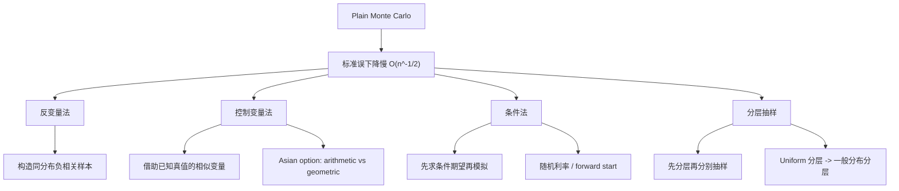

# 蒙特卡洛模拟（Topic 3）
> 资料来源：`Simulation_Topic3.pdf`  
> 主题：方差缩减（Variance Reduction）、反变量法（Antithetic Variates）、控制变量法（Control Variates）、条件法（Conditioning）、分层抽样（Stratified Sampling）

## 一句话理解

Topic 3 讨论的是：**当 Monte Carlo 已经“会算”之后，怎样在不改变目标期望的前提下，让估计更稳、更省样本、更快收敛。**

---

## 本 Topic 在整门课中的位置

Topic 1 建立了“采样 + 样本平均”的基础。  
Topic 2 说明了如何把这套框架用于金融定价。  
Topic 3 则直面一个现实问题：

> Monte Carlo 的标准误通常只按 $O(n^{-1/2})$ 下降，太慢了。

所以这一章的任务不是引入新模型，而是改造估计器，让我们在同样计算预算下得到更小误差。

---

## 本 Topic 讲了什么

课件结构可以整理成四类经典方差缩减方法：

| 模块 | 内容 |
| --- | --- |
| 3.1 | 反变量法（Antithetic Variates）与其在逆变换法中的结合 |
| 3.2 | 控制变量法（Control Variates）与 Asian option 定价 |
| 3.3 | 条件法（Conditioning / Conditional Monte Carlo） |
| 3.4 | 分层抽样（Stratified Sampling）：比例分配与最优分配 |

如果只用一句话概括，就是：

> 不去硬拼更多路径，而是想办法把“本来会波动的东西”配对、抵消、条件化或分层化。

---

## 为什么重要

Monte Carlo 最核心的瓶颈不是“能不能算”，而是“算得是否足够高效”。

因为如果

  $$
  \mathrm{SE}=O(n^{-1/2}),
  $$

那么：

- 把标准误减半，需要 4 倍样本
- 把标准误缩小到原来的十分之一，需要 100 倍样本

在复杂路径模型、多资产产品、美式期权或 Greeks 估计里，这种成本经常不可接受。  
所以方差缩减并不是“优化项”，而是 Monte Carlo 能否实用的关键。

---

## 一、反变量法：用负相关配对降低波动

### 核心思想

如果我们要估计某个期望

  $$
  \theta = \mathbb{E}[Y],
  $$

并且能够构造一个与 $Y$ 同分布、但和 $Y$ 负相关的变量 $\tilde Y$，那么可以改用配对平均：

  $$
  \hat\theta_{\mathrm{AV}}
  =
  \frac{1}{n}\sum_{i=1}^n \frac{Y_i+\tilde Y_i}{2}.
  $$

这个估计仍然无偏，但方差会变成

  $$
  \mathrm{Var}\!\left(\frac{Y+\tilde Y}{2}\right)
  =
  \frac{1}{4}\Bigl(\mathrm{Var}(Y)+\mathrm{Var}(\tilde Y)+2\mathrm{Cov}(Y,\tilde Y)\Bigr).
  $$

由于 $Y$ 与 $\tilde Y$ 同分布，上式可写成

  $$
  \mathrm{Var}\!\left(\frac{Y+\tilde Y}{2}\right)
  =
  \frac{1}{2}\mathrm{Var}(Y)+\frac{1}{2}\mathrm{Cov}(Y,\tilde Y).
  $$

所以只要

  $$
  \mathrm{Cov}(Y,\tilde Y)<0,
  $$

就会带来方差下降。

### 最经典的构造

如果 $U\sim \mathrm{Unif}(0,1)$，那么 $1-U$ 也服从同样分布。  
这就自然形成了一对反变量：

  $$
  U \quad \text{and} \quad 1-U.
  $$

若通过逆变换法生成随机变量

  $$
  X = F^{-1}(U),
  \qquad
  \tilde X = F^{-1}(1-U),
  $$

则 $X$ 与 $\tilde X$ 同分布，而且通常会呈现负相关。

### 在正态驱动路径中的写法

若一条路径由 $Z_1,\dots,Z_m \overset{i.i.d.}{\sim}N(0,1)$ 驱动，那么反变量路径就是

  $$
  (-Z_1,\dots,-Z_m).
  $$

也就是说：

- 第一条路径用一组正态样本
- 第二条路径用它们的相反数

这样得到的输出常常一个偏高、一个偏低，平均后更稳定。

### 对 Asian option 的直觉

对算术平均 Asian option 来说，一条路径整体偏高时，其反变量路径往往整体偏低，因此平均 payoff 容易相互对冲。

### 一句话理解

**反变量法不是减少随机性，而是把随机性成对摆放，让它们互相抵消。**

---

## 二、共同随机数与反变量的关系

课件还把“共同随机数（Common Random Numbers）”和“反变量”放在同一框架里比较。

若我们想估计

  $$
  \theta=\mathbb{E}[X-Y],
  $$

并通过逆变换法写成

  $$
  X=F^{-1}(U_1), \qquad Y=G^{-1}(U_2),
  $$

那么为了减小

  $$
  \mathrm{Var}(X-Y)=\mathrm{Var}(X)+\mathrm{Var}(Y)-2\mathrm{Cov}(X,Y),
  $$

我们希望尽量让 $\mathrm{Cov}(X,Y)$ 大。

### 两种常见耦合方式

| 方法 | 构造 | 作用方向 |
| --- | --- | --- |
| 共同随机数 | $U_2=U_1$ | 提高正相关，减小差值方差 |
| 反变量 | $U_2=1-U_1$ | 引入负相关，适合平均型估计 |

### 直觉区别

- 当目标是估计“两个量的差”时，通常想让它们同涨同跌，所以 common random numbers 很自然
- 当目标是估计“同一个量的期望”时，通常想让两个同分布样本一高一低，所以 antithetic variates 很自然

---

## 三、控制变量法：借助“已知答案的相似问题”降方差

### 基本想法

设我们真正想估计的是 $V_A$，但另一个与它高度相关、且真值已知的量 $V_B$ 也能同时模拟。

若对应的 Monte Carlo 估计分别为 $\hat V_A,\hat V_B$，则最简单的控制变量估计器是：

  $$
  \hat V_A^{\mathrm{cv}}
  =
  \hat V_A + (V_B-\hat V_B).
  $$

它的期望满足

  $$
  \mathbb{E}[\hat V_A^{\mathrm{cv}}]
  =
  \mathbb{E}[\hat V_A] + V_B - \mathbb{E}[\hat V_B]
  =
  V_A,
  $$

所以仍是无偏估计。

### 为什么有效

如果 $\hat V_A$ 和 $\hat V_B$ 在同一路径上高度相关，那么：

- 当 $\hat V_A$ 偏高时，$\hat V_B$ 通常也偏高
- 于是 $(V_B-\hat V_B)$ 会是负的
- 正好把 $\hat V_A$ 的偏高往下拉

### 带松弛参数的更一般形式

更常用的写法是

  $$
  \hat V_A(b)
  =
  \hat V_A + b(V_B-\hat V_B),
  $$

其方差为

  $$
  \mathrm{Var}\bigl(\hat V_A(b)\bigr)
  =
  \mathrm{Var}(\hat V_A)
  +
  b^2\mathrm{Var}(\hat V_B)
  -
  2b\,\mathrm{Cov}(\hat V_A,\hat V_B).
  $$

最优参数满足

  $$
  b^*
  =
  \frac{\mathrm{Cov}(\hat V_A,\hat V_B)}{\mathrm{Var}(\hat V_B)}.
  $$

带入后得到最小方差：

  $$
  \mathrm{Var}\bigl(\hat V_A(b^*)\bigr)
  =
  \mathrm{Var}(\hat V_A)
  -
  \frac{\mathrm{Cov}(\hat V_A,\hat V_B)^2}{\mathrm{Var}(\hat V_B)}.
  $$

### 常见误区

**误区：控制变量只要“已知真值”就一定有用。**

不对。  
关键不是已知真值本身，而是它和目标估计必须高度相关，否则纠偏作用很弱。

---

## 四、控制变量在 Asian option 里的经典用法

这是课件里最典型的金融例子之一。

### 基本设置

- 目标：算术平均 Asian option
- 控制量：几何平均 Asian option

原因是：

- 两者 payoff 非常相似，路径上高度相关
- 几何平均 Asian option 常常有解析价格公式

因此可以构造：

  $$
  \hat V_A^{\mathrm{cv}}
  =
  \hat V_A + (V_G-\hat V_G),
  $$

其中：

- $\hat V_A$ 是算术平均 Asian option 的模拟值
- $\hat V_G$ 是几何平均 Asian option 的模拟值
- $V_G$ 是几何平均 Asian option 的解析价格

### 为什么这招特别有效

因为两者使用的是同一条资产路径，只是 payoff 函数略有不同。  
于是额外计算成本很低，但协方差通常很高，降方差效果很好。

### 一句话理解

**控制变量法最适合“我不会解原题，但我能解一道很像的题”。**

---

## 五、条件法：先条件化，再模拟剩下的不确定性

### 理论核心

设

  $$
  Y=h(X), \qquad V=\mathbb{E}[Y\mid Z].
  $$

那么由塔式法则（Tower Property）可知

  $$
  \mathbb{E}[V]=\mathbb{E}\bigl[\mathbb{E}[Y\mid Z]\bigr]=\mathbb{E}[Y].
  $$

也就是说，我们完全可以用 $V$ 来代替 $Y$ 做 Monte Carlo。

更重要的是，条件方差分解给出：

  $$
  \mathrm{Var}(Y)
  =
  \mathbb{E}\bigl[\mathrm{Var}(Y\mid Z)\bigr]
  +
  \mathrm{Var}\bigl(\mathbb{E}[Y\mid Z]\bigr).
  $$

因此

  $$
  \mathrm{Var}\bigl(\mathbb{E}[Y\mid Z]\bigr)\le \mathrm{Var}(Y).
  $$

### 直觉

条件法的本质是：

> 能解析掉的随机性先解析掉，别把它留到 Monte Carlo 里继续摇。

### 生效条件

这个方法通常需要：

1. 条件变量 $Z$ 容易模拟
2. 条件期望 $\mathbb{E}[Y\mid Z]$ 能精确算出或便宜算出

---

## 六、条件法的两个金融例子

### 1. 随机利率下的欧式看涨期权

课件讨论了随机短利率（stochastic short rate）场景下的看涨期权。  
普通做法会同时模拟：

- 利率路径
- 股票路径

而条件法的想法是：

- 保留对利率过程的模拟
- 在给定某些条件变量后，把股票价格部分的条件期望直接写成 Black-Scholes 价格

这等于把原本更高维的随机积分问题，缩减成更低维的模拟问题。

### 2. Forward start / delayed option

对 forward start option，普通方法一条路径上要先模拟 $S_{t_1}$，再继续模拟 $S_T$。  
条件法则是在给定 $S_{t_1}$ 后，直接把从 $t_1$ 到 $T$ 的价值写成 Black-Scholes 公式。

这就把两次随机驱动，变成了一次模拟加一次解析定价。

### 一句话理解

**条件法不是“多加信息”，而是“把本来要随机模拟的那一部分，改成解析计算”。**

---

## 七、分层抽样：先把样本空间切块，再分别抽样

### 基本思想

若总体并不均匀，直接简单随机抽样可能导致某些区域被抽得过多，某些区域被抽得过少。  
分层抽样（Stratified Sampling）的做法是先用一个分层变量 $Y$ 把样本空间划分成若干层，再在每一层里单独抽样。

设 $Y$ 取值为 $\{y_1,\dots,y_k\}$，并且

  $$
  p_i=\mathbb{P}(Y=y_i), \qquad i=1,\dots,k.
  $$

那么

  $$
  \mathbb{E}[X]
  =
  \sum_{i=1}^k p_i\,\mathbb{E}[X\mid Y=y_i].
  $$

若第 $i$ 层抽取 $n_i$ 个样本，则分层估计器为：

  $$
  \hat\mu
  =
  \sum_{i=1}^k p_i
  \left(
    \frac{1}{n_i}\sum_{j=1}^{n_i}X_{ij}
  \right).
  $$

它是无偏的。

### 方差公式

若记

  $$
  \sigma_i^2=\mathrm{Var}(X\mid Y=y_i),
  $$

则

  $$
  \mathrm{Var}(\hat\mu)
  =
  \sum_{i=1}^k p_i^2\frac{\sigma_i^2}{n_i}.
  $$

所以问题就变成：如何选 $n_i$ 最划算？

---

## 八、比例分配与最优分配

### 1. 比例分配（Proportional Allocation）

最简单做法是令

  $$
  n_i = n p_i.
  $$

也就是每层抽样数量按其总体占比来分。

### 2. 最优分配（Optimal Allocation）

更进一步，如果知道每层波动大小 $\sigma_i$，则在总样本数固定下，最优选择是：

  $$
  q_i = \frac{n_i}{n}
  =
  \frac{p_i\sigma_i}{\sum_{m=1}^k p_m\sigma_m}.
  $$

这意味着：

- 层越大，应该多抽
- 层内方差越大，也应该多抽

### 直觉

最优分配不是平均主义，而是“把样本配给更值得抽的层”。

### 方差分解视角

课件给出的一个非常有启发性的理解是：

  $$
  \mathrm{Var}(X)
  =
  \mathbb{E}[\mathrm{Var}(X\mid Y)]
  +
  \mathrm{Var}(\mathbb{E}[X\mid Y]).
  $$

分层抽样本质上是在消灭“层与层之间”的波动，把采样集中到每层内部的波动上。

---

## 九、最基础的分层：对 Uniform(0,1) 分层

课件把最基础也最常见的分层方法写得很清楚：  
先对 $U\sim \mathrm{Unif}(0,1)$ 的定义域等分。

把区间分成 $k$ 段：

  $$
  I_1=\left[0,\frac{1}{k}\right), \quad \dots, \quad
  I_k=\left[\frac{k-1}{k},1\right].
  $$

在第 $i$ 层中，可通过

  $$
  U_{ij}=\frac{i-1}{k}+\frac{V_{ij}}{k},
  \qquad
  V_{ij}\sim \mathrm{Unif}(0,1),
  $$

来生成条件样本。

如果我们要估计 $\mathbb{E}[h(U)]$，则分层估计器就是各层样本均值的加权平均。

### 推广到一般分布

若要估计 $\mathbb{E}[h(X)]$，可以借助逆变换法把它改写成

  $$
  X=F^{-1}(U),
  \qquad
  \mathbb{E}[h(X)]
  =
  \mathbb{E}[h(F^{-1}(U))].
  $$

于是仍可以先对 $U$ 分层，再映射回 $X$。

### 金融中的典型应用

课件给了欧式看涨期权、spread option 等例子。  
对单变量正态驱动的产品，可以对 $U$ 分层后通过 $\Phi^{-1}(U)$ 转成正态；  
对二维问题，则可以对两个 Uniform 同时分层，再通过 Cholesky 结构映射到相关正态。

---

## Topic 3 方法总图

---

## 常见误区

### 误区 1：方差缩减就是“同样结果更快算出来”

更准确地说，方差缩减改变的是估计器，而不是目标值本身。  
好的方法是用更聪明的随机结构去估计同一个期望。

### 误区 2：反变量法一定有效

不一定。  
关键条件是配对后真的形成负协方差；若输出几乎不呈反向波动，收益会很有限。

### 误区 3：控制变量只要解析值已知就总是强力

不对。  
若控制量和目标量相关性不高，控制变量法的效果会明显变差。

### 误区 4：条件法只是“数学上更漂亮”

不只是漂亮。  
它直接减少需要模拟的随机性，因此通常能显著降低方差。

### 误区 5：分层抽样只是把样本“平均分配”

也不对。  
真正高效的分层抽样通常依赖合理分层变量与合理样本分配，尤其是最优分配。

---

## 本 Topic 小结

### 这篇笔记真正建立了什么

- 理解反变量法为何依赖负相关
- 理解共同随机数与反变量分别适合什么目标
- 理解控制变量法为何本质上是在用“可观测误差”修正目标估计
- 理解条件法如何用条件期望消灭不必要的随机波动
- 理解分层抽样如何通过结构化抽样减少层间波动
- 理解比例分配与最优分配的差异

### 一句话总结

**Topic 3 教会我们的不是新的定价模型，而是新的估计思想：同样是 Monte Carlo，估计器设计得更聪明，误差就可以小很多。**

---

## 可继续思考的问题

1. 在真实金融产品里，怎样判断某个控制变量是否“足够像”目标变量？
2. 条件法和控制变量法能否同时使用？它们各自消灭的是哪一部分波动？
3. 分层抽样在高维问题中为什么会变得困难？这和“如何选分层变量”有什么关系？
4. 反变量法为什么常常作为“大方案中的一个组件”，而不是单独成为最强方法？
