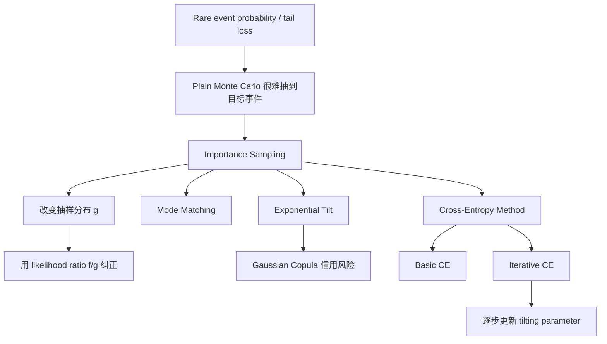

# 蒙特卡洛模拟（Topic 4）
> 资料来源：`Simulation_Topic4.pdf`  
> 主题：稀有事件模拟（Rare Event Simulation）、重要抽样（Importance Sampling）、Gaussian Copula 信用风险、交叉熵方法（Cross-Entropy Method）

## 一句话理解

Topic 4 讨论的是：**当我们关心的是极小概率但高影响的事件时，普通 Monte Carlo 几乎抽不到这些事件，必须主动改变抽样分布，把模拟资源集中到“真正重要但极少出现”的区域。**

---

## 本 Topic 在整门课中的位置

前面三篇已经建立了完整路线：

- Topic 1：会采样、会估计
- Topic 2：会把 Monte Carlo 用到定价
- Topic 3：会设计更高效的估计器

Topic 4 则进一步面对最难的一类问题：

> 目标事件非常罕见，plain Monte Carlo 几乎看不见它。

这在金融、保险、信用风险、系统失效分析里都非常常见，因为真正决定风险管理和资本计提的，往往不是“平常发生什么”，而是“极端情况下会发生什么”。

---

## 本 Topic 讲了什么

从课件结构看，Topic 4 可以整理成三大块：

| 模块 | 内容 |
| --- | --- |
| 4.1 | 重要抽样（Importance Sampling）：稀有事件的本质、似然比（Likelihood Ratio）、mode matching |
| 4.2 | Gaussian Copula 组合信用风险：违约相关、指数倾斜（Exponential Tilt） |
| 4.3 | 交叉熵方法（Cross-Entropy Method）：KL 散度最小化、正态分布下的更新公式、迭代算法 |

如果只保留主线，可以概括为：

> 先改变抽样分布，让极端事件“更常被抽到”，再用 likelihood ratio 把估计纠正回原问题。

---

## 为什么重要

假设我们要估计尾部概率

  $$
  \ell = \mathbb{P}(X\ge \gamma)=\mathbb{E}[1_{\{X\ge \gamma\}}],
  $$

当 $\gamma$ 很大时，$\ell$ 可能非常小。  
这时 crude Monte Carlo 的方差和相对误差会变得非常糟糕。

课件给了一个非常有代表性的量级判断：  
如果 $\ell=10^{-6}$，想把相对误差做到 1%，普通 Monte Carlo 需要的样本量大约是

  $$
  N \approx 10^{10}.
  $$

这在很多实际问题里是完全不可接受的。

### 典型稀有事件场景

- 深度虚值期权（deep out-of-the-money options）
- 大规模贷款组合同时违约
- 保险公司破产概率
- 高可靠系统失效概率
- 极端尾部损失（tail loss）

### 一句话理解

**稀有事件的困难不在于公式有多复杂，而在于“你几乎抽不到它”。**

---

## 一、重要抽样：换一个分布来抽样

### 基本框架

设我们想计算

  $$
  \theta = \mathbb{E}_f[h(X)],
  $$

其中 $X$ 在原分布 $f$ 下抽样。  
现在改用另一个分布 $g$ 来抽样，只要两者有相同支撑，就有

  $$
  \theta
  =
  \int h(x)f(x)\,dx
  =
  \int h(x)\frac{f(x)}{g(x)}g(x)\,dx
  =
  \mathbb{E}_g\!\left[h(X)\frac{f(X)}{g(X)}\right].
  $$

于是重要抽样估计器可以写成：

  $$
  \hat\theta_{\mathrm{IS}}
  =
  \frac{1}{N}\sum_{j=1}^N h(X_j)\frac{f(X_j)}{g(X_j)},
  \qquad X_j\sim g.
  $$

这里

  $$
  L(X)=\frac{f(X)}{g(X)}
  $$

称为似然比（Likelihood Ratio）或 Radon-Nikodym 权重。

### 为什么有效

plain Monte Carlo 的问题是：

- 真正有贡献的区域很少被抽到

importance sampling 的想法是：

- 故意让这些区域更容易被抽到
- 然后用 likelihood ratio 把权重修正回来

### 理想但不可用的零方差分布

若 $h(x)\ge 0$，那么理论上若能选

  $$
  g(x)\propto h(x)f(x),
  $$

则估计器方差可以做到 0。  
但问题是这个归一化常数本身正是我们要计算的目标，所以它只提供了一个“指导方向”：

> 好的 $g$ 应该尽量去模仿 $h(x)f(x)$ 的形状。

---

## 二、重要抽样在正态分布下的均值平移

### 最常见的选择

若 $X\sim N(0,1)$，可以考虑改成

  $$
  X\sim N(\mu,1).
  $$

此时对应的密度比为：

  $$
  \frac{f(x)}{g(x)}
  =
  \exp\left(-\mu x + \frac{\mu^2}{2}\right).
  $$

这就是最经典的 mean shift / exponential tilting 思路。

### mode matching 直觉

课件反复强调的启发式准则是 mode matching：

> 让新的分布 $g$ 的众数，尽量落在 $h(x)f(x)$ 最大的地方。

若 $g$ 取正态 $N(\mu,1)$，其众数就是 $\mu$，于是通常取

  $$
  \mu = \arg\max_x h(x)f(x).
  $$

这不是万能最优解，但通常给出很好的初值和很实用的近似。

### 一句话理解

**重要抽样不是“多抽一点极端值”，而是“系统性地把抽样中心推向真正有贡献的区域”。**

---

## 三、深度虚值期权：plain MC 为什么会失败

课件用深度虚值欧式看涨期权给了一个非常直观的例子。

### 问题本质

若

  $$
  V = e^{-rT}\mathbb{E}[(S_T-K)^+],
  $$

而 $K$ 远大于 $S_0$，则大多数路径上 payoff 都是 0。  
也就是说：

- 样本均值主要靠极少数路径贡献
- 标准误会非常大
- 即使样本数已经很大，置信区间仍可能很差

### 为什么重要抽样有效

如果把驱动正态变量从 $N(0,1)$ 改成 $N(\mu,1)$，并把 $\mu$ 推向价内区域，那么：

- 更容易抽到 $S_T>K$ 的路径
- 有贡献样本数显著增加
- 同样样本量下估计更稳定

### 课件里的关键信息

对极深虚值期权，plain Monte Carlo 在极大样本数下仍可能保持较高标准误；而 importance sampling 即便用粗略选取的平移参数，也能显著改善精度。

---

## 四、Gaussian Copula 组合信用风险

### 组合信用风险的基本对象

课件把组合损失写成

  $$
  L = X_1+\cdots+X_m,
  $$

其中第 $k$ 个 obligor 的损失是

  $$
  X_k = v_k Y_k,
  $$

这里：

- $Y_k\in\{0,1\}$ 是是否违约的指标
- $v_k$ 是违约损失（loss given default）
- $p_k$ 是边际违约概率

### Gaussian Copula 的核心机制

违约相关性通过潜变量（latent variables）来引入。  
设

  $$
  Y_k = 1_{\{\xi_k > x_k\}},
  $$

其中阈值 $x_k$ 由边际违约概率决定：

  $$
  x_k = \Phi^{-1}(1-p_k).
  $$

潜变量再通过因子模型构造相关性：

  $$
  \xi_k = a_{k1}Z_1+\cdots+a_{kd}Z_d+b_k\varepsilon_k,
  $$

其中：

- $Z_1,\dots,Z_d$ 是共同系统因子
- $\varepsilon_k$ 是个体特有风险

### 稀有事件问题在信用风险中的体现

我们通常关心的是：

- 大额组合损失概率
- tranche 的尾部风险
- 多个 obligor 同时违约导致的大损失

这些往往是 rare events。  
所以 plain Monte Carlo 直接模拟时，会出现“大损失样本几乎抽不到”的问题。

---

## 五、指数倾斜（Exponential Tilt）

在组合信用风险和正态场景下，课件重点提到了一类非常常见的重要抽样策略：指数倾斜（Exponential Tilt）。

### 直觉

与其在原分布下苦等“大损失自己出现”，不如：

- 把分布向“大损失更容易出现”的方向倾斜
- 再用 likelihood ratio 纠正

### 本质

指数倾斜可以理解为重要抽样在指数族（尤其正态分布）中的一个自然参数化方式。  
它的好处是：

- 分布形式保持简单
- 似然比容易写
- 参数调优空间清晰

在 Gaussian copula 或高维正态向量下，这种做法尤其自然，因为“平移均值向量”就能有效控制尾部事件的出现频率。

---

## 六、交叉熵方法：系统地寻找好的重要抽样分布

### 为什么需要交叉熵方法

importance sampling 的关键不是“会不会写 likelihood ratio”，而是：

> 怎样挑一个好的 $g$？

mode matching 是一个很有用的启发式，但在高维问题或复杂 payoff 下，手工挑参数会变得困难。  
于是课件引入了交叉熵方法（Cross-Entropy Method）。

### 核心思想

交叉熵方法本质上是在一个参数化分布族 $\{f_\theta\}$ 中，寻找最接近理想零方差分布的成员。  
这里的“接近”通常用 Kullback-Leibler 散度（KL divergence）衡量。

可以把它理解成：

> 用优化的方法，自动寻找最适合 importance sampling 的 tilting parameter。

### 正态分布族中的基本更新

若原分布是标准正态、候选族是 $N(\mu,1)$，则 basic cross-entropy 方法会给出一种基于 pilot sample 的更新：

  $$
  \hat\mu
  =
  \frac{\sum_{k=1}^N h(X_k)X_k}{\sum_{k=1}^N h(X_k)},
  \qquad X_k\sim N(0,1).
  $$

在多维正态下，对向量参数也有类似加权平均更新。

### 直觉

权重 $h(X_k)$ 越大，说明该样本越接近“真正对目标期望有贡献的区域”，因此新参数就越应该向这些样本靠拢。

### basic CE 的局限

课件强调了一点：  
当 rare event 太 rare 时，pilot sample 里可能几乎没有正贡献样本，于是分母可能接近 0，算法会出现不稳定，甚至 `NaN`。

也就是说：

- basic cross-entropy 在中等难度问题上很好用
- 但在极端稀有事件下，可能会失效

---

## 七、一般迭代交叉熵算法

为了解决 basic CE 在极端尾部上的不稳定，课件进一步引入了迭代交叉熵算法。

### 两阶段循环

每次迭代都做两件事：

1. 用当前参数 $\hat\theta_j$ 生成 pilot samples
2. 根据这些样本更新到 $\hat\theta_{j+1}$

最终得到一个更合适的 tilting parameter，再用它进行 importance sampling。

### 迭代的好处

它不是一步把分布硬推到目标区域，而是逐步靠近。  
这在 rare event 极其罕见时尤其重要，因为一次性平移可能：

- 太弱，抽不到目标区域
- 太强，导致 likelihood ratio 剧烈波动

### 实际经验

课件指出：

- 对中等难度问题，1 到 2 次迭代可能就够
- 对更极端的 rare events，4 到 5 次迭代通常已经很实用

### 一句话理解

**basic CE 是“一步估参数”，iterative CE 是“边抽边修正参数，逐步把抽样分布推向有贡献区域”。**

---

## 八、抛硬币例子：稀有事件模拟的直觉示范

课件最后用“100 次公平抛硬币中至少 80 次正面”的例子来说明 rare event simulation 的本质。

### plain Monte Carlo 的问题

这个事件的概率极小，普通模拟中：

- 大多数 trial 输出都是 0
- 偶尔才出现一次成功
- 为了得到稳定估计，需要极端多的试验次数

### importance sampling 的想法

如果在新测度下把“正面概率”从 $1/2$ 改成某个更大的 $q$，那么成功事件就会更常出现。  
但每次成功不能简单记为 1，而要乘以 likelihood ratio。

### 一个关键提醒

课件特别强调：

> importance sampling 不是把 rare event 概率改得越大越好。

因为如果新分布选得太激进，likelihood ratio 会剧烈波动，反而导致方差爆炸。  
所以“让 rare event 变常见”和“保持权重平稳”之间必须平衡。

---

## Topic 4 方法总图

---

## 常见误区

### 误区 1：稀有事件只是样本数不够，多跑就行

理论上是这样，实际上往往不可行。  
因为 rare event 概率太小时，所需样本量可能大到完全没有计算意义。

### 误区 2：重要抽样就是把分布尽量往尾部推

不对。  
如果推得太狠，likelihood ratio 可能波动更大，方差反而上升。

### 误区 3：只要估计器无偏，就一定高效

不对。  
rare event simulation 里，无偏只是底线，真正关键是方差和相对误差。

### 误区 4：cross-entropy 方法一定稳定

basic CE 在非常稀有的事件上可能失败，因为 pilot sample 中正贡献样本太少。  
这也是 iterative CE 重要的原因。

### 误区 5：信用风险中的 Gaussian copula 只是“相关正态的另一个名字”

并不只是这样。  
它真正做的是通过 latent variables 与阈值结构，把连续相关因子映射成离散违约事件相关性。

---

## 本 Topic 小结

### 这篇笔记真正建立了什么

- 理解 rare event 为什么会让 plain Monte Carlo 失效
- 理解 importance sampling 的换测度逻辑
- 理解 likelihood ratio 为什么保证无偏
- 理解 mode matching 如何启发性地选择新分布
- 理解 Gaussian copula 组合信用风险中的 tail loss 模拟需求
- 理解 cross-entropy 方法其实是在“学”最合适的重要抽样分布
- 理解 iterative CE 为什么比 basic CE 更适合极端稀有事件

### 一句话总结

**Topic 4 让 Monte Carlo 真正具备处理尾部风险的能力：不是被动等极端事件出现，而是主动把模拟引向极端区域，再用概率权重把答案校正回来。**

---

## 可继续思考的问题

1. importance sampling 中“让 rare event 更常出现”和“控制 likelihood ratio 波动”之间，怎样平衡才算好？
2. basic cross-entropy 和 iterative cross-entropy 的本质差别是什么？为什么 rare event 越稀有，迭代越重要？
3. Gaussian copula 模型里，如果 latent factor 的分布不再是正态，重要抽样和 CE 方法还应怎样改写？
4. 在实际风险管理中，我们真正关心的往往不是单个 tail probability，而是 ES、VaR 或 tranche loss；这些量的 rare event simulation 会比本文更难在哪里？
