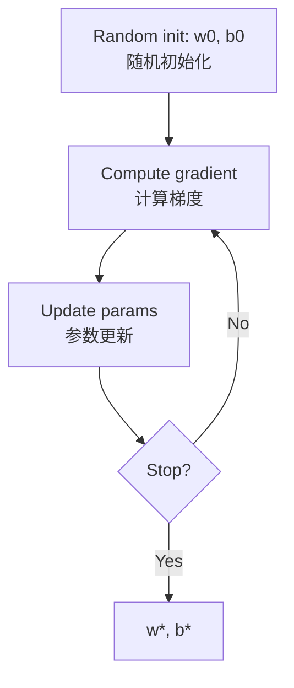

# 李宏毅机器学习（Lecture 1）
# Hung-yi Lee ML (Lecture 1)

> Video: [YouTube Lecture](https://www.youtube.com/watch?v=Ye018rCVvOo&list=PLJV_el3uVTsMhtt7_Y6sgTHGHp1Vb2P2J&index=1)  

## A. 本讲核心结论 / Core takeaways

**中文**
- 机器学习可以被视为：**让机器自动找到一个合适函数（function）**。
- 三大任务：**Regression / Classification / Structured Learning**。
- 经典流程是三步：**定义模型（Model）→ 定义损失（Loss）→ 做优化（Optimization）**。
- 在案例中，模型改进来自 **Domain Knowledge**（观察到每周周期后改模型）。

---

## B. 什么是机器学习 / What is Machine Learning

**中文**  
这节课最重要的一句话：机器学习就是让机器具备“找函数”的能力。  
给机器一个输入，机器输出你要的结果；关键在于，这个映射函数通常非常复杂，人手写不出来，所以靠数据和算法去“学”出来。

**课堂例子**
- 语音识别：声音讯号 -> 文字  
- 影像辨识：图片 -> 标签  
- AlphaGo：棋盘状态 -> 下一步落子位置

---

## C. 三大任务

### 1) Regression（回归）
- **中文**：输出是一个连续数值（scalar）。  
- **English**: Output is a continuous scalar value.  
- **Example**: 预测明天中午 PM2.5 数值。

### 2) Classification（分类）
- **中文**：输出是从预先定义好的类别中选一个。  
- **English**: Output is a choice among predefined classes.  
- **例子 / Examples**:
  - 垃圾邮件检测：Yes / No  
  - AlphaGo 也可看作分类：在 19x19 个落子位置里选一个

### 3) Structured Learning（结构化学习）
- **中文**：输出是有结构的对象，不只是一个数字或一个类别。  
- **English**: Output is a structured object, not just a scalar/class.  
- **例子 / Examples**: 生成文章、画图、复杂序列输出。

---

## D. 三步骤方法论 / The three-step recipe

### Step 1: 写出带未知参数的函数（Model）

**中文**  
先提出一个“可学习”的函数形式（带未知参数），例如：

`y = b + w * x1`

- `x1`：feature（已知输入，例如前一天观看数）  
- `w`：weight（与 feature 相乘的参数）  
- `b`：bias（偏置项）

**English**  
Start with a parametric model, e.g.:

`y = b + w * x1`

- `x1`: feature  
- `w`: weight  
- `b`: bias

> 重点 / Key point: 这个“先猜一个模型形式”的动作通常来自你对问题的理解（domain knowledge）。

### Step 2: 定义损失函数（Loss）

**中文**  
Loss 是一个函数，输入是模型参数（如 `w, b`），输出是这组参数“好不好”。  
常见定义：
- MAE: 平均绝对误差
- MSE: 平均平方误差
- Cross-Entropy: 常见于概率输出/分类任务

**English**  
Loss maps parameters (`w, b`) to a quality score.  
Common choices:
- MAE
- MSE
- Cross-Entropy

> 注意 / Note: Loss 的具体形式是你定义的；所以在一般讨论中，loss 值也可能出现负值（取决于定义）。

### Step 3: 优化参数（Optimization）

**中文**  
目标是找到让 Loss 最小的参数（如 `w*`, `b*`）。  
本课采用 Gradient Descent（梯度下降）。

**English**  
Find parameters that minimize loss (e.g., `w*`, `b*`) using Gradient Descent.

---

## E. 梯度下降直觉图 / Gradient Descent intuition

**更新公式 / Update rule**
- `w <- w - eta * dL/dw`
- `b <- b - eta * dL/db`

其中 `eta` 是 learning rate（学习速率），属于 **hyperparameter**（你要自己设定）。

---

## F. 课程案例：YouTube 点阅预测 / Case study: YouTube view forecasting

### 任务定义 / Task
- 输入：频道历史统计（如过去观看数）
- 输出：隔天总观看人次

### 版本 1：只看前一天 / Version 1: One-day lag
- 模型：`y = b + w * x1`
- 训练（2017-2020）误差：约 `0.48k`
- 测试（2021 未见数据）误差：约 `0.58k`

### 观察后改进（引入 domain knowledge）

课程中观察到明显**每周周期性**（例如周五周六偏低），于是把前 7 天都纳入：

`y = b + sum(wj * xj), j=1..7`

- 训练误差：`0.38k`
- 测试误差：`0.49k`

继续扩大输入窗口：
- 28 天：训练 `0.33k`，测试 `0.46k`
- 56 天：训练 `0.32k`，测试约 `0.46k`（提升有限）

**中文结论**：更多特征不一定无限提升，最终会有收益递减。  
**English takeaway**: Increasing history window helps up to a point, then returns diminish.

---

## G. local minima 讨论 / On local minima

**中文**  
课上展示了局部最小值（local minima）与全局最小值（global minima）的概念，并指出：在深度学习实践里，“local minima 常被过度担心”，真正痛点通常另有所在（后续课程会展开）。

**English**  
The lecture introduces local vs global minima, while hinting that in deep learning practice, local minima are often overemphasized.

---

## H. 术语

- Model：带未知参数的函数 / A parametric function  
- Feature：输入特征 / Input variable  
- Label：真实答案 / Ground truth  
- Weight：特征系数 / Feature coefficient  
- Bias：偏置项 / Intercept term  
- Loss：参数好坏指标 / Parameter quality score  
- Hyperparameter：人为设定项（如 learning rate）/ User-set config

---

## I. 复盘问题 

1. 你当前任务属于 Regression / Classification / Structured Learning 哪一类？  
2. 你的 Loss 是否真的反映业务目标？  
3. 你是否利用了 domain knowledge 去改模型结构，而不仅是调参数？

