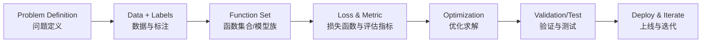

# 李宏毅机器学习（Lecture 1）  
# Hung-yi Lee ML (Lecture 1)

> 来源视频 / Source: [YouTube Lecture](https://www.youtube.com/watch?v=Ye018rCVvOo&list=PLJV_el3uVTsMhtt7_Y6sgTHGHp1Vb2P2J&index=1)

## 1) 机器学习的本质 / What ML really is

**中文**  
机器学习的核心不是“会调包”，而是：  
1. 明确你想优化的目标（objective）  
2. 用数据定义“好坏”（loss / metric）  
3. 让模型在训练中学到能泛化的规律（generalization）

**English**  
Machine learning is not just using libraries. It is about:  
1. Defining the objective clearly  
2. Quantifying good vs. bad with data (loss / metrics)  
3. Learning patterns that generalize beyond training data

---

## 2) 三大任务 / Three major ML tasks

### A. 回归 / Regression
- **中文**：预测连续数值（如房价、销售额、收益率）  
- **English**: Predict continuous values (e.g., house price, sales, returns)

### B. 分类 / Classification
- **中文**：预测离散类别（如是否违约、是否欺诈）  
- **English**: Predict discrete classes (e.g., default vs. non-default, fraud vs. normal)

### C. 结构化预测 / Structured Prediction
- **中文**：输出是有结构的对象（序列、文本、图结构）  
- **English**: Output is structured (sequence, text, graph-like objects)

---

## 3) 机器学习三步骤 / Three-step workflow

### Step 1: 定义函数集合 / Define function set (model family)
- **中文**：选择假设空间（线性模型、树模型、神经网络等）  
- **English**: Choose hypothesis space (linear models, trees, neural nets, etc.)

### Step 2: 定义“好坏” / Define goodness (loss + metric)
- **中文**：训练时最小化损失，验证时看业务相关指标  
- **English**: Minimize loss in training; evaluate with task-relevant metrics

### Step 3: 找到最优函数 / Find the best function (optimization)
- **中文**：通过优化算法（如梯度下降）求参数，并用验证集防过拟合  
- **English**: Use optimization (e.g., gradient descent) and validation to avoid overfitting

---

## 4) 自制图示 / Self-made visual aid

**中文解读**：你真正要训练的不是“模型本身”，而是一整套“问题定义 + 数据 + 目标 + 优化”的系统。  
**English note**: In practice, you train a full system (problem/data/objective/optimization), not only a model architecture.

---

## 5) 一个金融例子 / A finance-flavored example

### 任务 / Task
- **中文**：信用违约预测（分类）  
- **English**: Credit default prediction (classification)

### 三步骤落地 / Mapping to the 3-step workflow
1. **函数集合 / Function set**  
   - 中文：先用 Logistic Regression 或 XGBoost  
   - English: Start with Logistic Regression or XGBoost
2. **好坏标准 / Goodness**  
   - 中文：训练看 log loss；业务看 AUC、KS、召回率  
   - English: Optimize log loss; monitor AUC, KS, recall
3. **求最优 / Optimization**  
   - 中文：交叉验证 + 阈值选择 + 校准（calibration）  
   - English: Cross-validation + threshold tuning + probability calibration

---

## 6) 初学者高频误区 / Common beginner mistakes

1. **只盯模型，不盯目标** / Focusing on models, not objectives  
2. **训练集很高分就放心** / Trusting high train score without validation  
3. **把评估指标和业务脱节** / Using metrics disconnected from business impact

---

## 7) 本节复盘 / Quick recap

**中文**  
- 机器学习本质：定义目标、量化好坏、学到可泛化规律  
- 三大任务：回归、分类、结构化预测  
- 三步骤：函数集合 → 好坏标准 → 优化求解  

**English**  
- ML essence: objective, measurable goodness, and generalization  
- Three task types: regression, classification, structured prediction  
- Three-step recipe: function set -> goodness -> optimization

---

## 8) 可执行练习 / Actionable exercises

1. 选一个金融任务（如欺诈识别），写出三步骤对应内容。  
2. 只用一个 baseline 模型，先把验证流程跑通。  
3. 记录一个失败案例：是数据问题、目标问题，还是优化问题？

