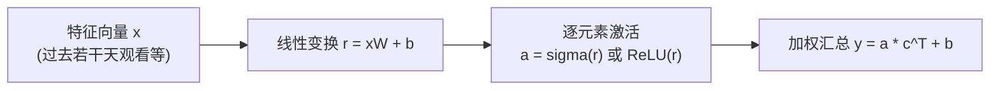

# 李宏毅机器学习（Lecture 2）
# Hung-yi Lee ML (Lecture 2)

> 视频 / Video: [YouTube 课程](https://www.youtube.com/watch?v=bHcJCp2Fyxs&list=PLJV_el3uVTsMhtt7_Y6sgTHGHp1Vb2P2J&index=2)  

---

## A. Linear 的 Model Bias（模型偏差）到底是什么

上一节我们能用 **Linear Model（线性模型）** 近似一些函数，但它的表达能力很有限：

- 在 Linear Model 里，特征 \(x_1\) 与输出 \(y\) 的关系永远是“一条直线”（随着 \(x_1\) 变大，\(y\) 单调变化）。
- 现实世界可能是“有拐点”的：先上升、到阈值后下降（或反过来），甚至呈现“分段”（piecewise）的形状。

所以问题不在于你“调参（optimization）失败”，而在于模型本身的限制：

**Model Bias（模型偏差）**  
> 注意：这不是参数里的 **Bias（偏置项）**（课堂上强调：“Model bias”和“\(b\) 的 bias”含义不同）。

---

## B. 用 Piecewise Linear 曲线逼近任意形状（思路）

把“更灵活的函数”想象成：

1) 一个常数项（constant）  
2) 加上若干个“蓝色函数”（blue function），每个蓝色函数负责制造一个“拐点/斜坡段”

这样你就能把“红色复杂曲线”看成：

> 红色曲线 = 常数 + 多个蓝色函数的叠加

### 为什么拐点越多需要的函数越多

| 红色曲线特征（piecewise） | 需要的蓝色函数数量（直觉） |
|---|---|
| 拐点很少 | 需要的蓝色函数少 |
| 拐点很多 | 需要的蓝色函数多 |

---

## C. 把“蓝色函数”做出来：从 Hard Sigmoid 到 Sigmoid

蓝色函数可以被视为一种分段形状，并提到它通常对应：

- **Hard Sigmoid（硬 Sigmoid）**：分段“平坦—斜坡—平坦”的形状
- 可以用更平滑的 **Sigmoid（S 型函数）** 来逼近它

### 1）Sigmoid 的形状（给出公式）

为了读起来更直观，我们用“缩放+平移”的写法：

  $$
    y = c \cdot \sigma\!\left(-(b + w x_1)\right)
    \quad\text{其中}\quad
    \sigma(t)=\frac{1}{1+e^{t}}
  $$

三类可调：

- 改 \(w\)：影响斜率（slope / steepness）
- 改 \(b\)：左右移动（shift）
- 改 \(c\)：改高度（scale / amplitude）

### 2）为什么“叠加很多 Sigmoid 就能逼近复杂函数”

单个 Sigmoid 很像一个“可平移可缩放的 S 型坡”。  

通过调整参数 \(w,b,c\)，Sigmoid 可以变成不同位置/不同斜率/不同高度的“蓝色函数（blue function）”。  

然后把许多这样的蓝色函数叠加起来，就可以逐渐逼近更复杂的 **Piecewise Linear（分段线性）** 曲线。  

再进一步：如果你在任意连续函数上取足够多的点，用折线去“连起来”，折线与原曲线可以非常接近；而折线本身又能由叠加的 Sigmoid 逼近，因此可以逼近任意连续函数（直觉层面）。

---

## D. 把 Linear 的 Model Bias 降下来：从 Linear Model 到「Sigmoid Sum Model」

上面讲的是“蓝色函数叠加的表达能力”。把它真正写成一个模型就是：

  \[
    y \;=\; b \;+\; \sum_{i} c_i \cdot \sigma\!\left(b_i + \sum_{j} w_{ij}\,x_j\right)
  \]

这里的含义（全是“未知参数（unknown parameters）”）：

- \(x_j\)：第 \(j\) 个 **特征（feature）**（已知输入），例如过去第 \(j\) 天的观看人次  
- \(w_{ij}\)：进入第 \(i\) 个 Sigmoid/Neuron 的权重  
- \(b_i\)：第 \(i\) 个 Neuron 内部的偏置（bias）  
- \(c_i\)：把第 \(i\) 个 Neuron 的输出加权后贡献到最终 \(y\)  
- 最外层 \(b\)：常数项（constant）  

> 课堂命名提醒：我们讨论的是 **Model Bias（模型偏差）**，它对应的是“模型类表达能力不足”，不是只调一个参数里的 \(b\)。

---

## E. 多特征 → 矩阵形式（线性代数写法更简洁）

当你有多个特征（例如考虑前 3 天：\(x_1,x_2,x_3\)；或前 56 天），老师用“向量/矩阵”把大量加减写成一句话。

用直觉记号表示：

1. 先做线性变换得到向量 \(r\)（每个元素对应一个内部输入）  
2. 再对向量每个元素分别做激活函数（Sigmoid 或 ReLU）得到 \(a\)  
3. 最后对 \(a\) 做加权求和得到输出 \(y\)

可以写成：

  $$
    r = xW + b \quad,\quad a = \sigma(r)\quad,\quad y = a\,c^\top + b
  $$

（这里 \(W\)、\(b\)、\(c\) 都是需要通过训练学习的未知参数）

把所有未知参数“拉直拼起来”，得到一个大向量：

- \(\theta\)：所有未知参数的集合（vector of parameters）

---

## F. 神经网络结构（从特征到输出的直观流程）

解释（对应上图）：

- 第一步把输入特征线性组合成内部变量 \(r\)（线性代数的一层）
- 第二步通过激活函数（Activation Function）把线性结果“塑形”（Sigmoid / ReLU）
- 第三步再把激活结果加权求和得到最终输出 \(y\)

---

## F. Loss 还是同一个套路：\(L(\theta)\) → Gradient Descent

有了更复杂的模型后，第二步定义损失 **Loss（loss）** 的方式没有本质变化：

- 你给定某一组参数 \(\theta\)
- 用模型做预测 \(\hat{y}\)
- 与真实标签 label（真实值）做差得到误差，再汇总成 \(L(\theta)\)

第三步依然是优化 **Optimization**，算法依然是 **Gradient Descent（梯度下降）**：

- 因为参数数量变多，你就不能像“穷举参数”那样直接爆搜  
- 所以需要梯度信息去迭代更新 \(\theta\)

---

## G. Batch（小批量）训练：Update vs Epoch

实际训练中，Gradient Descent 通常用 **Mini-batch（小批量）**。

一个例子强调概念：

- 总数据量：\(N\)
- Batch size：\(B\)
- 每次只用一个 batch 算损失（例如叫作 \(L_1\)），再用它的梯度更新参数
- 看完所有 batch，就完成一次 **Epoch（轮次）**

### 更新次数大致等于：\(\frac{N}{B}\)

所以：

- **Update（一次更新）**：参数更新一次（基于一个 batch 的梯度）
- **Epoch（一个轮次）**：所有 batch 都走完一遍

> 这也是为什么你在文献里看到 “我训练了 3 epochs”，它不等价于 “更新了 3 次参数”。

---

## H. Activation Function：Sigmoid / Hard Sigmoid / ReLU

在神经网络里，Sigmoid 或 ReLU 统称为 **Activation Function（激活函数）**。

老师回答了一个常见问题：  
**既然 Hard Sigmoid 可能难写，为什么一定要用 Soft Sigmoid（替代 Sigmoid）？**

直觉：Hard Sigmoid 可以用 **ReLU（ReLU）** 组合出来。

ReLU 的表达可写成一种 “阈值后线性” 的形式：

  $$
    \text{ReLU}(x) \;=\; c\cdot \max(0,\; b + w x)
  $$

如果用 ReLU 去合成一个 Hard Sigmoid，通常需要 **两段 ReLU 的组合**（直觉层面：把“平坦段+斜坡段”的结构做出来）。

因此 activation 的选择可以有很多合理实现方式；老师在后续实验中选择了 ReLU。

---

## I. 实验结果：ReLU 个数 vs 网络深度

**提高表达能力**（更多激活单元、更多层）能提升拟合，但**不保证泛化**（可能过拟合）。

下面给出课程里提到的关键数值：

### 1）从 Linear → 更多 ReLU：表达更灵活，但收益递减

| 模型（56天特征） | 训练误差（train） | 未见过数据误差（test） | 现象 |
|---|---:|---:|---|
| Linear Model | 0.32k | 0.46k | 基线 |
| 10 ReLU | 约同量级 | 约同量级 | 进步不明显 |
| 100 ReLU | 0.28k | 有所改善 | 显著更复杂 |
| 1000 ReLU | 再略低 | 改善有限 | 继续加不再明显 |

### 2）堆叠层数：深度增加提升拟合，但可能过拟合

在用 **56天特征**做实验时，老师展示了层数变化带来的 train/test 差异：

| 网络深度 | 训练误差（train） | 未见过数据误差（test） | 结论 |
|---|---:|---:|---|
| 1 层（单次） | 0.28k | 0.43k（约） | 基础 |
| 2 层 | 0.18k | 更好一点（课程强调“有改善”） | 提升 |
| 3 层 | 0.14k | 0.38k | 观察到更好的泛化 |
| 4 层 | 0.10k（训练更好） | 0.44k（变差） | 过拟合 |

**核心词：Overfitting（过拟合）**  
- 训练集上越来越好（train loss 更低）  
- 但未见过数据上反而变差（test loss 更高）

---

## J. 预测未知数据：为什么选 3 层而不是 4 层

训练集（已见数据）上的数字并不能决定你该选哪个模型。  
你要关心的是：**在未见数据上哪个更好**。

所以：

- 选 **3 层**更符合“未见数据更低误差”的证据

课堂最后做了预测演示：

- 用训练得到的 3 层网络去预测当天观看人次  
- 以当时可得的数据作为输入假设  
- 预测结果得到一个数值（课程里示例约为 3.96k）
- 下一周再用真实统计值评估误差

---

## K. 小结：从 Linear Bias 到 Neural Network

用一句话串起来：

1. Linear Model 的限制叫 **Model Bias**  
2. 通过叠加 Sigmoid（或用 ReLU 合成结构）可以制造更灵活函数  
3. 用向量/矩阵写法把模型组织成可训练的参数集合 \(\theta\)  
4. 损失 + 梯度下降 + mini-batch 训练  
5. 更多层/更多单元能拟合，但要警惕 **Overfitting**

---

## L. 复盘问题

| 思考 | 题目|
|---|---|
| 1. 画“模型偏差” | 给出一个红色真实曲线的直觉形状，并说明为什么 linear 做不到 |
| 2. 写公式 | 把 \(y = b + \sum c_i \sigma(b_i + \sum w_{ij}x_j)\) 用你自己的话解释每个符号 |
| 3. overfitting判断 | 看到 train loss 更低但 test loss 更高时，你会怎么选模型？ |

